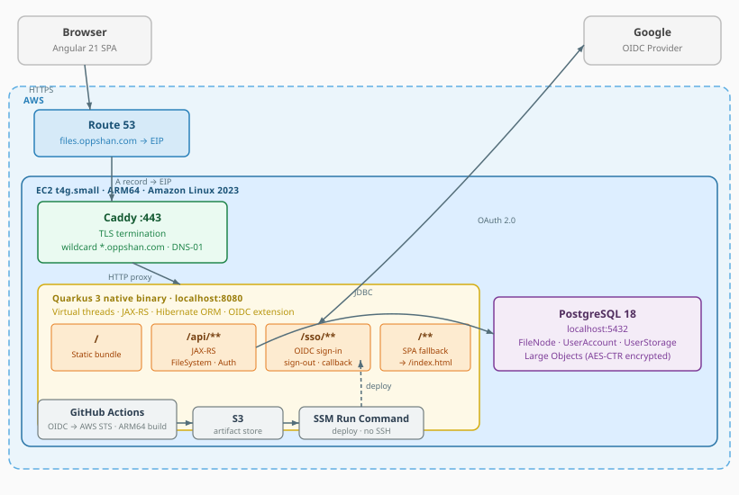
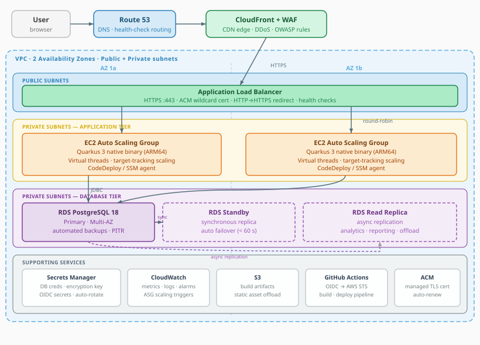

# Files

> A web-based personal file manager — live at **[files.oppshan.com](https://files.oppshan.com)**.

[](https://raw.githubusercontent.com/warrenmnocos/oppshan-files/main/.github/badges/jacoco.svg)
[](https://github.com/warrenmnocos/oppshan-files/actions/workflows/maven.yml)
[](https://github.com/warrenmnocos/oppshan-files/actions/workflows/qodana_code_quality.yml)


---

## Table of Contents

- [Project Overview](#project-overview)
    - [Repository](#repository)
- [Project Management](#project-management)
    - [Board structure](#board-structure)
    - [Branch and pull request convention](#branch-and-pull-request-convention)
    - [Sprint plan](#sprint-plan)
    - [Labels and delivery tiers](#labels-and-delivery-tiers)
    - [User Stories](#user-stories)
- [Tech Stack](#tech-stack)
- [Architecture](#architecture)
    - [Component architecture](#component-architecture)
    - [Deployment architecture](#deployment-architecture)
        - [Minimal deployment](#minimal-deployment)
        - [Production deployment](#production-deployment)
- [Frontend Architecture](#frontend-architecture)
    - [Event bus and reactive pattern](#event-bus-and-reactive-pattern)
    - [CQRS split](#cqrs-split)
    - [Notification system](#notification-system)
    - [Dialog pattern](#dialog-pattern)
    - [Standalone components and signals](#standalone-components-and-signals)
    - [File layout](#file-layout)
- [Backend Architecture](#backend-architecture)
    - [Endpoint structure](#endpoint-structure)
    - [Polymorphic file/folder handling](#polymorphic-filefolder-handling)
    - [Streaming uploads on virtual threads](#streaming-uploads-on-virtual-threads)
    - [Hibernate UserType for transparent encryption](#hibernate-usertype-for-transparent-encryption)
    - [Named native queries with CTEs](#named-native-queries-with-ctes)
    - [Session-scoped user account caching](#session-scoped-user-account-caching)
    - [File layout](#file-layout-1)
- [Data Model](#data-model)
    - [User domain](#user-domain)
    - [File domain](#file-domain)
    - [View records (DTOs)](#view-records-dtos)
- [File Streaming and Encryption](#file-streaming-and-encryption)
    - [Upload pipeline](#upload-pipeline)
    - [Download pipeline](#download-pipeline)
- [API Reference](#api-reference)
    - [Public (no authentication)](#public-no-authentication)
    - [Authenticated endpoints](#authenticated-authenticated-oidc-http-only-cookie)
- [Security](#security)
    - [Authentication](#authentication)
    - [File encryption](#file-encryption)
    - [Input validation](#input-validation)
    - [Startup validation](#startup-validation)
    - [Database role](#database-role)
- [Database](#database)
    - [Migrations](#migrations)
    - [Sequence allocation](#sequence-allocation)
- [User Experience Design](#user-experience-design)
    - [Sign in](#sign-in-us-01)
    - [Empty drive](#empty-drive-us-02-us-05)
    - [Populated drive — list view](#populated-drive--list-view-us-06-us-07)
    - [Populated drive — grid view](#populated-drive--grid-view-us-08)
    - [File context menu](#file-context-menu-us-20)
    - [Folder context menu](#folder-context-menu-us-21)
    - [Empty space context menu](#empty-space-context-menu-us-22)
    - [Create folder dialog](#create-folder-dialog-us-09)
    - [Rename dialog](#rename-dialog-us-10-us-17)
    - [Delete confirmation dialog](#delete-confirmation-dialog-us-11-us-18)
    - [Properties panel](#properties-panel-us-12-us-19)
    - [Upload progress](#upload-progress-us-13-us-14)
    - [Profile dropdown](#profile-dropdown-us-03-us-04-us-23)
    - [Error states and notifications](#error-states-and-notifications-us-15-us-24)
- [CI/CD](#cicd)
    - [Continuous Integration](#continuous-integration)
        - [Build, test, and coverage](#build-test-and-coverage)
        - [Static analysis](#static-analysis)
    - [Continuous Deployment](#continuous-deployment)
        - [Build pipeline](#build-pipeline)
        - [Deployment target](#deployment-target)
        - [Deployment automation](#deployment-automation)
- [Development Setup](#development-setup)
    - [Prerequisites](#prerequisites)
    - [Environment variables](#environment-variables)
    - [Running locally](#running-locally)
    - [Running tests](#running-tests)
    - [Production build](#production-build)

---

## Project Overview

**Files** is a full-stack personal cloud file manager. Authenticated users can upload, organize, download, rename,
delete, and inspect files and folders through a browser-based interface. It supports nested directory hierarchies,
drag-and-drop streaming uploads with per-file progress tracking, switchable list and grid view modes, and a
notification center that surfaces operation outcomes in real time. All uploaded file content is encrypted at rest
using AES/CTR with per-file initialization vectors and a key derived via PBKDF2.

This project is developed as the final exam for **ITMD 504 — Programming and Application Foundations** at
**Illinois Institute of Technology**.

### Repository

- **Source code:** [github.com/warrenmnocos/oppshan-files](https://github.com/warrenmnocos/oppshan-files)
- **Project board:** [github.com/users/warrenmnocos/projects/1](https://github.com/users/warrenmnocos/projects/1)
- **Live application:** [files.oppshan.com](https://files.oppshan.com)

---

## Project Management

This project follows an Agile workflow using **GitHub Projects** as the Kanban board, **GitHub Issues** as the backlog,
and **GitHub Milestones** as sprint containers. Every user story is a tracked issue, every implementation lives on a
named feature branch, and every merge to `main` is gated by a reviewed pull request that auto-closes the originating
issue. The board is available at
[github.com/users/warrenmnocos/projects/1](https://github.com/users/warrenmnocos/projects/1).

### Board structure

The Kanban board uses three columns: **To Do** for stories not yet started, **In Progress** for stories with an active
branch, and **Done** for stories whose pull request has merged and whose issue has auto-closed. The board is filtered
with `is:issue` to exclude pull requests from the view, preventing visual duplication since each PR is already linked
to its corresponding issue.


### Branch and pull request convention

Every user story follows a consistent workflow. The branch is created from the GitHub issue sidebar, producing a name
like `3-us-01-sign-in-with-google` where `3` is the issue number. Commits reference the issue with the format
`refs #3 Implement Google OIDC callback endpoint`. Pull requests are titled `feat/US-01: Sign In with Google` and
include `Closes #3` in the body, which triggers auto-close of the issue and moves the card to Done upon merge. Epic
merge commits use the prefix `refs #<n> Merged feat/EPIC-0x: <description>`.

### Sprint plan

The project is organized into six sprints targeting a **May 9, 2026** submission deadline.

| Sprint | Window          | Epic                                                                                           | User Stories                                                                                                                                  | Status  |
|--------|-----------------|------------------------------------------------------------------------------------------------|-----------------------------------------------------------------------------------------------------------------------------------------------|---------|
| 1      | Mar 25 – Apr 4  | [[EPIC-01]](https://github.com/warrenmnocos/oppshan-files/issues/2) Authentication and Account | [[US-01]](https://github.com/warrenmnocos/oppshan-files/issues/3) through [[US-04]](https://github.com/warrenmnocos/oppshan-files/issues/6)   | Done    |
| 2      | Apr 5 – Apr 11  | [[EPIC-02]](https://github.com/warrenmnocos/oppshan-files/issues/9) Navigation and Layout      | [[US-05]](https://github.com/warrenmnocos/oppshan-files/issues/10) through [[US-08]](https://github.com/warrenmnocos/oppshan-files/issues/13) | Done    |
| 3      | Apr 12 – Apr 18 | [[EPIC-03]](https://github.com/warrenmnocos/oppshan-files/issues/14) Folder Management         | [[US-09]](https://github.com/warrenmnocos/oppshan-files/issues/15) through [[US-12]](https://github.com/warrenmnocos/oppshan-files/issues/18) | Done    |
| 4      | Apr 19 – Apr 25 | [[EPIC-04]](https://github.com/warrenmnocos/oppshan-files/issues/19) File Management           | [[US-13]](https://github.com/warrenmnocos/oppshan-files/issues/20) through [[US-19]](https://github.com/warrenmnocos/oppshan-files/issues/26) | Done    |
| 5      | Apr 26 – May 2  | [[EPIC-05]](https://github.com/warrenmnocos/oppshan-files/issues/27) Context Menu              | [[US-20]](https://github.com/warrenmnocos/oppshan-files/issues/28) through [[US-22]](https://github.com/warrenmnocos/oppshan-files/issues/30) | Planned |
| 6      | May 3 – May 9   | [[EPIC-06]](https://github.com/warrenmnocos/oppshan-files/issues/31) Storage                   | [[US-23]](https://github.com/warrenmnocos/oppshan-files/issues/32) and [[US-24]](https://github.com/warrenmnocos/oppshan-files/issues/33)     | Planned |

### Labels and delivery tiers

Stories are organized by epic and priority tier. Epic labels scope each story to its functional area:
`epic: authentication and account`, `epic: navigation and layout`, `epic: folder management`,
`epic: file management`, `epic: context menu`, and `epic: storage`. Priority labels indicate delivery criticality.
Tier assignments are shown in the User Stories table below.

### User Stories

Full acceptance criteria for each story live on the linked GitHub issue.

<table>
  <thead>
    <tr>
      <th>Epic</th>
      <th>User Story</th>
      <th>Tier</th>
      <th>Status</th>
    </tr>
  </thead>
  <tbody>
    <tr>
      <td rowspan="4"><a href="https://github.com/warrenmnocos/oppshan-files/issues/2">[EPIC-01] Authentication and Account</a></td>
      <td><a href="https://github.com/warrenmnocos/oppshan-files/issues/3">[US-01] Sign in with Google</a></td>
      <td>Core</td>
      <td></td>
    </tr>
    <tr>
      <td><a href="https://github.com/warrenmnocos/oppshan-files/issues/4">[US-02] Redirect to root directory after sign-in</a></td>
      <td>Core</td>
      <td></td>
    </tr>
    <tr>
      <td><a href="https://github.com/warrenmnocos/oppshan-files/issues/5">[US-03] Sign out</a></td>
      <td>Core</td>
      <td></td>
    </tr>
    <tr>
      <td><a href="https://github.com/warrenmnocos/oppshan-files/issues/6">[US-04] Profile panel</a></td>
      <td>Exceeded</td>
      <td></td>
    </tr>
    <tr>
      <td rowspan="4"><a href="https://github.com/warrenmnocos/oppshan-files/issues/9">[EPIC-02] Navigation and Layout</a></td>
      <td><a href="https://github.com/warrenmnocos/oppshan-files/issues/10">[US-05] Root directory on login</a></td>
      <td>Core</td>
      <td></td>
    </tr>
    <tr>
      <td><a href="https://github.com/warrenmnocos/oppshan-files/issues/11">[US-06] Navigate by clicking a folder</a></td>
      <td>Core</td>
      <td></td>
    </tr>
    <tr>
      <td><a href="https://github.com/warrenmnocos/oppshan-files/issues/12">[US-07] Breadcrumb navigation</a></td>
      <td>Core</td>
      <td></td>
    </tr>
    <tr>
      <td><a href="https://github.com/warrenmnocos/oppshan-files/issues/13">[US-08] Grid/list view toggle</a></td>
      <td>Exceeded</td>
      <td></td>
    </tr>
    <tr>
      <td rowspan="4"><a href="https://github.com/warrenmnocos/oppshan-files/issues/14">[EPIC-03] Folder Management</a></td>
      <td><a href="https://github.com/warrenmnocos/oppshan-files/issues/15">[US-09] Create folder</a></td>
      <td>Core</td>
      <td></td>
    </tr>
    <tr>
      <td><a href="https://github.com/warrenmnocos/oppshan-files/issues/16">[US-10] Rename folder</a></td>
      <td>Exceeded</td>
      <td></td>
    </tr>
    <tr>
      <td><a href="https://github.com/warrenmnocos/oppshan-files/issues/17">[US-11] Delete folder recursively</a></td>
      <td>Core</td>
      <td></td>
    </tr>
    <tr>
      <td><a href="https://github.com/warrenmnocos/oppshan-files/issues/18">[US-12] Folder properties</a></td>
      <td>Exceeded</td>
      <td></td>
    </tr>
    <tr>
      <td rowspan="7"><a href="https://github.com/warrenmnocos/oppshan-files/issues/19">[EPIC-04] File Management</a></td>
      <td><a href="https://github.com/warrenmnocos/oppshan-files/issues/20">[US-13] Upload via button</a></td>
      <td>Core</td>
      <td></td>
    </tr>
    <tr>
      <td><a href="https://github.com/warrenmnocos/oppshan-files/issues/21">[US-14] Upload via drag-and-drop</a></td>
      <td>Exceeded</td>
      <td></td>
    </tr>
    <tr>
      <td><a href="https://github.com/warrenmnocos/oppshan-files/issues/22">[US-15] Reject oversized files</a></td>
      <td>Core</td>
      <td></td>
    </tr>
    <tr>
      <td><a href="https://github.com/warrenmnocos/oppshan-files/issues/23">[US-16] Download</a></td>
      <td>Core</td>
      <td></td>
    </tr>
    <tr>
      <td><a href="https://github.com/warrenmnocos/oppshan-files/issues/24">[US-17] Rename file</a></td>
      <td>Exceeded</td>
      <td></td>
    </tr>
    <tr>
      <td><a href="https://github.com/warrenmnocos/oppshan-files/issues/25">[US-18] Delete file</a></td>
      <td>Core</td>
      <td></td>
    </tr>
    <tr>
      <td><a href="https://github.com/warrenmnocos/oppshan-files/issues/26">[US-19] File properties</a></td>
      <td>Exceeded</td>
      <td></td>
    </tr>
    <tr>
      <td rowspan="3"><a href="https://github.com/warrenmnocos/oppshan-files/issues/27">[EPIC-05] Context Menu</a></td>
      <td><a href="https://github.com/warrenmnocos/oppshan-files/issues/28">[US-20] File context menu</a></td>
      <td>Exceeded</td>
      <td></td>
    </tr>
    <tr>
      <td><a href="https://github.com/warrenmnocos/oppshan-files/issues/29">[US-21] Folder context menu</a></td>
      <td>Exceeded</td>
      <td></td>
    </tr>
    <tr>
      <td><a href="https://github.com/warrenmnocos/oppshan-files/issues/30">[US-22] Empty-space context menu</a></td>
      <td>Exceeded</td>
      <td></td>
    </tr>
    <tr>
      <td rowspan="2"><a href="https://github.com/warrenmnocos/oppshan-files/issues/31">[EPIC-06] Storage</a></td>
      <td><a href="https://github.com/warrenmnocos/oppshan-files/issues/32">[US-23] Storage usage bar</a></td>
      <td>Polish</td>
      <td></td>
    </tr>
    <tr>
      <td><a href="https://github.com/warrenmnocos/oppshan-files/issues/33">[US-24] Quota enforcement</a></td>
      <td>Polish</td>
      <td></td>
    </tr>
  </tbody>
</table>

---

## Tech Stack

The backend is built with **Quarkus 3.34.3** on **Java 25** (Oracle GraalVM). The framework's advanced
capabilities are exercised throughout: classic JAX-RS endpoints run on the **Undertow** servlet container, whose
worker pool is replaced at deployment time by the custom `VirtualThreadServletExtension` so every request handler
executes on a **virtual thread** — blocking JDBC and `InputStream` reads are free of platform-thread cost without
giving up scalability; **Hibernate ORM** validates the Flyway-managed schema on startup and uses named native
queries with recursive CTEs for breadcrumb resolution and directory aggregates; **a custom Hibernate `UserType`**
(`EncryptedBlobUserType`) transparently encrypts and decrypts file content at the persistence boundary; the
**Quarkus OIDC extension** delegates Google sign-in entirely; and **Quarkus Dev Services** provisions ephemeral
PostgreSQL and Keycloak containers for the test profile.

The frontend is built with **Angular 21** as standalone components, signals-first. **Two-way data binding** flows
through `signal()`, `model()`, `input()`, and `output()` primitives; reactive lists, dialog visibility, and
notifications all use `@if`/`@for` control flow rather than the legacy structural directives; route loading uses
`loadComponent` for code splitting; class-transformer hydrates DTOs with strong typing; and a **custom
`MessageBusService` event bus** provides cross-cutting CQRS coordination across 13 dedicated listeners.

The build pipeline uses **Maven** as the top-level orchestrator, with the **frontend-maven-plugin** compiling the
Angular project and emitting the bundle into `src/main/resources/META-INF/resources/`, where Quarkus serves it as
static content. Production targets a **GraalVM native image** for ARM64. Code quality is monitored with **JaCoCo**
test coverage and **JetBrains Qodana** static analysis.

The application is deployed on a single **AWS EC2 t4g.small** (Graviton 2 ARM64) instance running **Amazon Linux 2023**,
with **PostgreSQL 18 on the same instance**. **Caddy** terminates TLS and proxies to Quarkus on localhost. DNS is
managed through **AWS Route 53** with an A record pointing to a static EIP.

---

## Architecture

Files uses a **single-origin deployment model**: the Angular SPA and the Quarkus REST API are served from the same
domain (`files.oppshan.com`), eliminating CORS and the need for a separate CDN or frontend hosting service.

### Component architecture

The component diagram below shows the internal layers of the application.


The **frontend** is an Angular 21 SPA structured around a central `MessageBusService` event bus. User actions fire
`*Initiated` events; dialogs escalate them to `*Confirmed` commands; 13 single-responsibility listeners receive those
commands, call the relevant service, and emit `*Succeeded` or `*Failed` outcomes. `AuthService` and `FileService`
make the HTTP calls; `NotificationService` drives the `NotificationCenter` component. The `SessionHttpInterceptor`
handles 499 session-expiry responses by redirecting to sign-in.

The **backend** is a Quarkus 3 native binary whose three JAX-RS endpoint classes delegate to two services:
`FileNodeService` owns all file-system mutations under a single `@Transactional` boundary, and
`UserSessionManager` caches the authenticated user per HTTP session with read/write locking.
Both services depend only on their respective Jakarta Data repositories, which issue JPQL queries and named native
queries (recursive CTEs for breadcrumbs and directory statistics). The `EncryptedBlobUserType` intercepts all Hibernate
Blob reads and writes, transparently applying AES/CTR encryption with a per-file IV prepended to each Large Object.
Every JAX-RS handler runs on a virtual thread supplied by `VirtualThreadServletExtension`, so blocking JDBC and
streaming I/O carry no platform-thread cost.

**PostgreSQL 18** holds all state: the unified `file_node` inode table (directories and files share one schema,
distinguished by a `directory` boolean), the user domain tables, and PostgreSQL Large Objects for encrypted file
content. A `BEFORE DELETE` trigger calls `lo_unlink` on each Large Object to reclaim storage when a file node is
deleted. Flyway manages schema migrations; Hibernate validates the schema on startup.

### Deployment architecture

#### Minimal deployment

The deployment diagram below shows the full request path through the AWS infrastructure.



The application runs on a single **EC2 t4g.small** (Graviton 2 ARM64) instance. **Caddy** terminates TLS on port 443
using a wildcard `*.oppshan.com` certificate obtained automatically from Let's Encrypt via DNS-01 challenge against
Route 53, then proxies plain HTTP to **Quarkus** on `localhost:8080`. Quarkus dispatches requests across four routing
zones: `/` serves the pre-compiled Angular bundle, `/api/**` routes to JAX-RS endpoints, `/sso/**` drives the OIDC
sign-in and sign-out flows with Google as the identity provider, and any remaining URL falls through to
`FrontendRoutesFilter` which returns `/index.html` so the Angular router owns deep-link navigation. All data is
persisted in **PostgreSQL 18** running on the same instance. Operator access uses **SSM Session Manager** — no port 22
is exposed and no SSH key pair is required. The CI/CD pipeline — GitHub Actions building a GraalVM native binary on an
ARM64 runner, uploading to S3, and deploying via **SSM Run Command** — is shown at the bottom of the diagram.

#### Production deployment

The current deployment is intentionally minimal — a single EC2 instance with on-instance PostgreSQL is sufficient
and cost-effective for a university project. A production-grade deployment serving real traffic would replace
each single point of failure with a managed, multi-AZ equivalent.



**Networking.** The VPC spans two Availability Zones with separate public and private subnets in each. Only the
ALB sits in the public subnets; the application and database tiers are fully isolated in private subnets with no
direct inbound internet access. A NAT Gateway in each public subnet provides outbound connectivity for the private
tiers (OS updates, SSM agent, Secrets Manager API calls).

**Edge and TLS.** **CloudFront** sits in front of the ALB and serves as both a CDN (caching the Angular static
bundle at edge locations worldwide) and a WAF attachment point (OWASP managed rule group blocks SQLi, XSS, and
common scanners before traffic reaches the origin). **ACM** issues and auto-renews the TLS certificate; the ALB
terminates HTTPS and forwards plain HTTP to the instances, eliminating all certificate management from the
application tier.

**Application tier.** An **Auto Scaling Group** runs the Quarkus native binary across both AZs. The ASG uses a
target-tracking policy on ALB request count per target so capacity scales in and out automatically under load.
The ALB performs health checks against the Quarkus health endpoint and routes around failed instances. Blue/green
or rolling deployments via **CodeDeploy** replace instances without downtime; the GitHub Actions pipeline uploads
the native binary to S3, then triggers the deployment group.

**Database tier.** **Amazon RDS** for PostgreSQL 18 in Multi-AZ mode synchronously replicates every write to a standby
in the second AZ. On primary failure, RDS automatically promotes the standby and updates the cluster endpoint — typical
failover is under 60 seconds with no application change. An asynchronous **read replica** can offload analytics or
reporting queries, or serve as a warm promotion target if eventual-consistency reads are acceptable. Automated backups
with point-in-time recovery, storage auto-scaling, and Performance Insights replace all manual DBA work that on-instance
PostgreSQL requires. **RDS Proxy** sits between the application tier and RDS, multiplexing database connections across
ASG instances to avoid connection exhaustion during scale-out events and reducing failover time by maintaining a warm
connection pool through Multi-AZ promotions.

**Secrets.** **AWS Secrets Manager** stores the database password, OIDC client credentials, and the encryption
passphrase. Secrets are fetched at startup via the Quarkus AWS Secrets extension and rotated automatically;
nothing sensitive lives in environment files or SSM Parameter Store plain text.

**Observability.** **CloudWatch** collects application logs (structured JSON from Quarkus), ALB access logs, RDS
Performance Insights metrics, and ASG instance-level metrics. Alarms on 5xx rate, p99 latency, and CPU drive the
auto-scaling policy and page on-call via SNS.

| Concern        | Minimal deployment                 | Production deployment                           |
|----------------|------------------------------------|-------------------------------------------------|
| TLS            | Caddy + Let's Encrypt DNS-01       | ACM cert on ALB, auto-renewed                   |
| Availability   | Single EC2 instance                | ASG across 2 AZs, ALB health checks             |
| Database       | On-instance PostgreSQL             | RDS Multi-AZ + read replica                     |
| Database proxy | None                               | RDS Proxy (connection pooling, faster failover) |
| Scaling        | Manual resize                      | Target-tracking ASG on ALB RPS                  |
| Secrets        | SSM Parameter Store                | Secrets Manager with auto-rotation              |
| CDN / WAF      | None                               | CloudFront + WAF OWASP rules                    |
| Observability  | SSM Session Manager + systemd logs | CloudWatch Logs, metrics, alarms                |

---

## Frontend Architecture

### Event bus and reactive pattern

The Angular frontend is built around a central `MessageBusService` that owns a `Subject<ApplicationEvent>`. Every
mutation flows through the bus:

1. A user action fires an `*Initiated` event with a context payload.
2. A dialog (if needed) fires a `*Confirmed` command event after user confirmation.
3. A **listener** receives the command, calls the relevant service method, and fires `*Succeeded` or `*Failed`.
4. Downstream listeners react to the outcome — refreshing directory contents, surfacing notifications, updating
   progress entries.

**Listeners are single-responsibility and output-only.** Each listener receives one event type and emits event
types as its only output. A listener that performs an HTTP call must not also mutate service state directly; those
concerns are split across dedicated listeners. For example, `FileCreateConfirmedApplicationEventListener` fires
upload lifecycle events (`FileUploadInitiated`, `FileUploadProgressUpdated`, `FileUploadSucceeded`,
`FileUploadFailed`) and a separate `UploadProgressApplicationEventListener` translates those into
`NotificationService` calls.

The 13 listeners are registered in `app.config.ts` as multi-providers of the `MESSAGE_LISTENERS` injection token, and
`MessageReactorService` fans the event stream out to each listener's filter.

### CQRS split

- **Commands (mutations) → bus via listeners.** Components fire `*Confirmed` with a command payload; a listener
  calls the relevant service and emits `*Succeeded` or `*Failed`.
- **Queries (reads) → direct service calls.** Components inject `FileService` and call it in `ngOnInit` or `computed`.

### Notification system

All user-facing feedback flows through a unified `NotificationService` and is rendered by a single
`NotificationCenter` component fixed at the bottom-right of the screen. Two notification types share a common
`ApplicationNotification` base interface:

- **`MessageNotification`** — auto-dismissing toast for operation outcomes and errors. It carries a `MessageCode`
  translation key, optional `params: Record<string, unknown>` for interpolation, and severity derived from the key
  prefix (`messages.errors.*` → error, `messages.info.*` → info).
- **`ProgressNotification`** — live progress entry for long-running operations. It carries a `label` translation
  key, optional `params`, and a `progress: number` (0–100). Feature-agnostic: file uploads, future downloads, and any
  other progress-emitting operation use the same type. Entries are removed on completion; failures are removed
  immediately and surface as `MessageNotification` toasts.

The `NotificationCenter` renders progress entries in a collapsible section and toasts in a separate stack within
the same panel.

### Dialog pattern

Dialogs are siblings in the component tree, mounted via an `@if` gate on `applicationEvenTypeSignal()`:

```html
@if (messageBusService.applicationEvenTypeSignal() === ApplicationEventType.DirectoryCreateInitiated) {
<app-directory-creation-dialog/>
}
```

A trigger fires `*Initiated` with a context payload; the gate mounts the dialog; the dialog reads the payload via
`computed(() => bus.applicationEventSignal().payload as ContextType)`; confirming fires `*Confirmed`, cancelling
fires `*Cancelled`; any other event collapses the gate and unmounts the dialog.

### Standalone components and signals

Every component is `standalone: true` — there are no NgModules. State is held in signals (`signal`, `input`,
`input.required`, `computed`, `toSignal` for `Observable` interop); RxJS lives at the edges (HTTP, the bus
`Subject`, route URL streams). Subscriptions are torn down in `ngOnDestroy`.

### File layout

```
src/main/angular/src/app/
├── app.config.ts          # providers, listener registration, route loading
├── app.routes.ts          # /drive/**, /sso/sign-in, /sso/sign-out
├── pages/                 # Drive, SignIn, SignOut (all lazy-loaded)
├── components/            # Toolbar, FileBrowser, Breadcrumb, NotificationCenter,
│                          # ErrorState, 7 dialogs (directory + file each: create, rename,
│                          # delete, properties; file omits create-dialog and instead uses
│                          # the FileBrowser's built-in upload picker)
├── services/              # AuthService, FileService, MessageBusService, NotificationService,
│                          # MessageReactorService, JsonMapperService
├── listeners/             # 13 listener classes + AbstractApplicationEventListener +
│                          # MessageListener interface
├── models/                # ApplicationEvent envelope, ApplicationEventType (55 values),
│                          # MessageCode, command interfaces, outcome interfaces, view DTOs
└── misc/                  # auth.guard, SessionHttpInterceptor, pipes, utils
```

---

## Backend Architecture

### Endpoint structure

REST resources are organized under three roots. `AuthEndpoint` exposes `GET /api/auth/me` to return the current
`UserAccountView` (or 401). `SsoEndpoint` provides the OIDC entry, callback, and sign-out flows under `/sso/...`.
`FileSystemEndpoint` exposes the unified file system surface under `/api/files`. See [API Reference](#api-reference)
for a complete list.

### Polymorphic file/folder handling

The `FileNode` entity is a unified inode-style record: a row may represent either a file or a directory, controlled
by the `directory` boolean. As a result, several endpoints are polymorphic. `PATCH /api/files/{uuid}` dispatches to
`renameDirectory` or `renameFile`; `DELETE /api/files/{uuid}` dispatches to `deleteDirectory` or `deleteFile`;
`GET /api/files/{uuid}/properties` dispatches to `DirectoryPropertiesView` or `FilePropertiesView`. The endpoint and
the Angular app both treat the type as runtime data on the same record, so listing a directory returns a `FileNodeView`
list mixing both kinds.

### Streaming uploads on virtual threads

The application runs on **REST Classic** backed by the **Undertow** servlet container.
`VirtualThreadServletExtension` is registered via `META-INF/services/io.undertow.servlet.ServletExtension` and, at
deployment time, replaces Undertow's worker and async executors with a `Executors.newThreadPerTaskExecutor(...)`
backed by `Thread.ofVirtual()`. Every JAX-RS handler — including the upload endpoint — therefore executes on a
named virtual thread (`undertow-virtual-thread-N`); no per-method annotation is required. The handler reads the
servlet `InputStream` directly into the encryption pipeline. Backpressure propagates: if the application reads
slower than the network delivers, Undertow stops draining the connection's receive buffer, and TCP backpressure
reaches the client. The file is never buffered in memory or spooled to a temp file. See
[File Streaming and Encryption](#file-streaming-and-encryption) for the full pipeline.

### Hibernate UserType for transparent encryption

`EncryptedBlobUserType` is a Hibernate `UserType` that intercepts JDBC `Blob` reads and writes for the
`FileNode.content` column. On write, it wraps the incoming stream in an `IncomingBlob` that prepends a fresh 16-byte
IV and chains a `CipherInputStream` (AES/CTR/NoPadding). On read, it wraps the JDBC stream in an `OutgoingBlob`
that consumes the IV and chains a decryption cipher. Service code, repository code, and endpoint code never see
plaintext or ciphertext logic — they treat content as a `Blob`.

### Named native queries with CTEs

Three operations require recursive traversal of the file tree. Rather than fetching the tree row-by-row, each is
implemented as a `@NamedNativeQuery` with a recursive Common Table Expression and a custom
`@SqlResultSetMapping` to a record:

- **`FileNode.GET_DIRECTORY_STATISTICS`** — recursive CTE descends from a target directory and aggregates
  `folderCount`, `fileCount`, `totalSizeBytes`. Result mapped to `DirectoryStatistics`.
- **`FileNode.GET_ANCESTORS`** — recursive CTE walks up the parent chain from a target node. Result mapped to a
  list of `BreadcrumbView`.
- **`FileNode.RESOLVE_DIRECTORY_PATH`** — splits a path string and walks down the tree to resolve a slash-separated
  path into a target directory UUID.

### Session-scoped user account caching

`SessionScopedUserSessionManager` is a `@SessionScoped` `@Alternative @Priority(APPLICATION)` bean that wraps the
OIDC delegate and caches `UserAccountView` for the lifetime of the HTTP session. `getSessionUserAccount()` and
`signOut()` are guarded by `@Lock(Type.WRITE)`; `isSignedOut()` by `@Lock(Type.READ)`. The cache is reset by
`refreshSessionUserAccount()`, which the `FileSystemEndpoint` calls after every successful upload and delete so the
next `GET /api/auth/me` returns fresh `usedStorageBytes` for the toolbar storage display.

### File layout

```
src/main/java/com/oppshan/files/
├── auth/        # OIDC session management, sign-in/out endpoints, multi-tenant resolver
├── common/      # auditable entity base, route filter, virtual-thread extension, write-repo mixin
├── config/      # ApplicationStorage @ConfigMapping
├── exception/   # MessageCode enum, BusinessException factories, JAX-RS mapper, ErrorResponse
├── file/        # FileNode entity, repository, service, endpoint, view records, encryption
└── user/        # UserAccount, IdpAccount, GoogleAccount, UserStorage, services, repositories
```

---

## Data Model

The application uses four core entities organized across two domains. All primary keys are UUID v7 (time-ordered)
to keep B-tree indexes locality-friendly while avoiding integer-ID enumeration leaks.

### User domain

**`UserAccount`** represents a platform user. Fields: surrogate `id` (BIGINT sequence), `uuid` (UUID v7), `firstName`,
`lastName`, audit timestamps. It owns one or more `IdpAccount` rows and exactly one `UserStorage` row.

**`IdpAccount`** is the abstract base for identity-provider accounts using JPA joined-inheritance. Fields: `uuid`,
`providerId` (the external identifier from the IdP), `providerName` (e.g. "google"), and `userAccount` reference.
The abstraction is designed for multi-provider extensibility — adding GitHub or Microsoft requires a new
`IdpAccount` subclass plus an OIDC configuration entry, with no schema change to the file or user core.

**`GoogleAccount`** extends `IdpAccount` with the Google-specific fields `email`, `name`, `photoUrl`. It lives in a
separate `google_account` table joined to `idp_account` by primary key, with indexes on `name` and `email`.

### File domain

**`FileNode`** is the unified entity for both files and directories, following an inode-style design. Fields: `id`,
`uuid`, `name`, `mimeType`, `directory` (boolean), `sizeBytes`, `content` (`java.sql.Blob` mapped via
`@Type(EncryptedBlobUserType.class)`, fetched lazily and streamed end-to-end), `parentFileNode` (self-reference,
null for root), `childFileNodes` (a sorted set), audit timestamps. A database CHECK constraint enforces that
directories have null content and zero size while files have non-null content. The unique constraint
`(parent_file_node_id, name, mime_type) UNIQUE NULLS NOT DISTINCT` prevents duplicate names within the same parent
even at the root level (where `parent_file_node_id IS NULL`).

**`UserStorage`** tracks each user's quota. Fields: `id`, `uuid`, `userAccount` (one-to-one), `maxStorageBytes`,
`maxFileUploadBytes`, `rootFileNode` (one-to-one to the user's root `FileNode`), audit timestamps.

### View records (DTOs)

Endpoints return immutable Java `record` types — never entities. The principal views:

- `UserAccountView(uuid, firstName, lastName, email, photoUrl, usedStorageBytes, maxStorageBytes,
  maxFileUploadBytes, rootFileNodeUuid, createdAt, lastModifiedAt)` — current authenticated user.
- `FileNodeView(uuid, name, mimeType, directory, sizeBytes, parentUuid, createdAt, lastModifiedAt)` — a child
  in a directory listing.
- `DirectoryContentsView(uuid, name, parentUuid, breadcrumbViews, childrenFileNodeViews)` — the full payload for
  a directory page; the breadcrumb is embedded so the client never makes a second round trip.
- `BreadcrumbView(uuid, name)` — one ancestor in the breadcrumb trail.
- `DirectoryPropertiesView(uuid, name, createdAt, lastModifiedAt, directoryCount, fileCount, totalSizeBytes)` — the
  read-only properties dialog payload for a folder.
- `FilePropertiesView(uuid, name, mimeType, sizeBytes, parentUuid, parentName, createdAt, lastModifiedAt)` — the
  read-only properties dialog payload for a file.

The TypeScript side of each view shares field names 1:1 (kept in sync as a project discipline), and `class-transformer`
hydrates nested types via `@Type(() => X)`.

---

## File Streaming and Encryption

### Upload pipeline

```
File from <input type="file"> picker or webkitGetAsEntry() drop
   │
   ▼   (FileBrowser validates against UserAccountView.maxFileUploadBytes; rejects fire fileSizeExceeded toasts)
FileCreateConfirmedApplicationEventListener fires FileUploadInitiated
   │
   ▼   (Angular HttpClient.post, reportProgress: true, observe: 'events')
SessionHttpInterceptor (tap-only — passes every HttpEvent through)
   │
   ▼   (Content-Disposition: attachment; filename=...; original Content-Type)
HTTP request body
   │
   ▼   (Undertow servlet handler dispatched onto a virtual thread by VirtualThreadServletExtension)
servlet InputStream (blocking reads — TCP backpressure propagates if the consumer slows)
   │
   ▼
CountingInputStream                 ← tracks original byte count
   │
   ▼
IncomingBlob  ← prepends 16-byte IV from SecureRandom, then CipherInputStream (AES/CTR/NoPadding)
   │
   ▼
java.sql.Blob (handed to Hibernate as the FileNode.content value)
   │
   ▼
PostgreSQL Large Object (OID) — written by the JDBC driver as it consumes the encrypted stream
```

After `entityManager.flush()` forces the stream to be drained, `CountingInputStream.getCount()` yields the file's
original size. The service then verifies the size against `getMaxFileUploadBytes(userAccountUuid)` and the running
total against `getMaxStorageBytes(userAccountUuid)` — failing the transaction with `fileSizeExceeded` or
`fileQuotaExceeded` if either is exceeded. The `FileNode.sizeBytes` field receives the counted value and the
transaction commits atomically. On the client side, `OperationProgressApplicationEventListener` translates
`HttpEventType.UploadProgress` events into `FileUploadProgressUpdated` outcomes so the `NotificationCenter`'s
upload section reflects byte-accurate progress in real time; the final `HttpResponse` becomes either
`FileUploadSucceeded` (which refreshes directory contents and the toolbar storage display) or
`FileUploadFailed` (which surfaces a toast and removes the progress entry).

### Download pipeline

```
PostgreSQL Large Object (OID) — referenced by FileNode.content
   │
   ▼   (JTA transaction open; JDBC driver streams ciphertext)
java.sql.Blob (lazy-fetched, never materialised in memory)
   │
   ▼
OutgoingBlob  ← reads first 16 bytes as IV, then CipherInputStream (AES/CTR/NoPadding) over the remainder
   │
   ▼   (decrypted plaintext)
StreamingOutput (JAX-RS) wired by FileDownloadViewMessageBodyWriter
   │
   ▼   (Content-Disposition: attachment; filename=...; original Content-Type)
HTTP response body
   │
   ▼   (Angular HttpClient, reportProgress: true, observe: 'events')
browser anchor click → file saved to disk
```

`GET /api/files/{uuid}/download` returns a `FileDownloadViewResolver`. The custom
`FileDownloadViewMessageBodyWriter` opens a JTA transaction, loads the `FileNode`, wraps the `Blob` in an
`OutgoingBlob` that reads the first 16 bytes as the IV, initializes a decryption cipher, and returns a
`CipherInputStream` over the remaining ciphertext. The decrypted plaintext is piped to the HTTP response
through `StreamingOutput`. The transaction stays open for the duration of the download because the Large Object
stream requires an active transaction. On the client side, the Angular `HttpClient` subscribes with
`observe: 'events'` so the `OperationProgressApplicationEventListener` translates `HttpEventType.DownloadProgress`
events into `ProgressNotification` updates rendered in the `NotificationCenter`'s download section.

---

## API Reference

### Public (no authentication)

| Method | Path                                           | Purpose                             |
|--------|------------------------------------------------|-------------------------------------|
| GET    | `/sso/sign-in`                                 | Redirect to OIDC provider list      |
| GET    | `/sso/sign-in/oidc/{idpProviderName}`          | Start OIDC flow with given provider |
| GET    | `/sso/sign-in/oidc/callback/{idpProviderName}` | OIDC callback                       |
| POST   | `/sso/sign-out`                                | Terminate session                   |

### Authenticated (`@Authenticated`, OIDC HTTP-only cookie)

| Method | Path                           | Purpose                                                                                                                   |
|--------|--------------------------------|---------------------------------------------------------------------------------------------------------------------------|
| GET    | `/api/auth/me`                 | Current `UserAccountView` (200 with body, or 401 if unauthenticated)                                                      |
| GET    | `/api/files/{uuid}/contents`   | Directory contents by UUID                                                                                                |
| GET    | `/api/files/contents?path=...` | Directory contents by slash-separated path; empty path returns the user's root                                            |
| POST   | `/api/files`                   | Create a directory; body `{ name, parentUuid }`                                                                           |
| PATCH  | `/api/files/{uuid}`            | Rename a file or directory; body `{ name }`                                                                               |
| DELETE | `/api/files/{uuid}`            | Delete a file or directory (recursive for directories)                                                                    |
| GET    | `/api/files/{uuid}/properties` | Properties of a file or directory                                                                                         |
| POST   | `/api/files/{uuid}/upload`     | Stream a file into the directory; raw binary body, `Content-Disposition: attachment; filename=...`, `Content-Type` header |
| GET    | `/api/files/{uuid}/download`   | Stream a file out; sets `Content-Disposition: attachment` and original `Content-Type`                                     |

Errors are emitted as `400 Bad Request` with body `{ "messageCode": "messages.errors.<key>" }` (translated by the
Angular app via the i18n table). HTTP `401 Unauthorized` indicates session expiry; the Angular app's
`SessionHttpInterceptor`
redirects on `499` (custom session-invalidation status).

---

## Security

### Authentication

Authentication is delegated entirely to **Google OAuth 2.0** via the Quarkus OIDC extension. No passwords are stored
in the application. On first login, the backend extracts `sub` (Google's unique user identifier), `name`, `email`,
and `picture` from the ID token claims. If no `UserAccount` exists for that `sub`, a new `UserAccount`,
`GoogleAccount`, `UserStorage`, and root `FileNode` are created atomically. Subsequent logins match by Google `sub`
and reuse the existing user. The OIDC session is managed via HTTP-only cookies by Quarkus; the Angular app never sees
the
token. Token state is encrypted using the secret in `quarkus.oidc.token-state-manager.encryption-secret`.

The identity-provider abstraction (`IdpAccount` → `GoogleAccount`) is designed for multi-provider extensibility.
Adding a new provider (such as GitHub) requires a new entity extending `IdpAccount`, claim-extraction logic, and
an OIDC configuration entry — no changes to the existing user or file core.

### File encryption

All uploaded file content is encrypted at rest using **AES/CTR/NoPadding**. Each file gets a unique 16-byte
initialization vector generated by `SecureRandom`. The IV is prepended to the ciphertext within the same Large
Object, making the encryption self-contained per file with no separate IV column needed.

The encryption key is derived at application startup using **PBKDF2WithHmacSHA256** with **1,000,000 iterations**
(per current OWASP guidance) from a passphrase stored in the environment variable
`APP_STORAGE_ENCRYPTION_PASSPHRASE`. The PBKDF2 derivation hardens weak passphrases against brute force. The
derived 256-bit AES key is cached in memory for the application's lifetime.

On Graviton ARM64 instances, AES/CTR benefits from hardware acceleration via ARMv8 Cryptographic Extensions, which
are enabled by default on AWS Graviton processors.

The encryption is transparent to the rest of the application. The `IncomingBlob` and `OutgoingBlob` wrappers
implement `java.sql.Blob` and handle encryption and decryption inside their `getBinaryStream()` methods. The
entity, service, and endpoint layers never interact with cipher logic directly.

### Input validation

File and folder names are validated by Hibernate Validator constraints (`@Size(max = 255)`, non-blank trimmed
checks) on request records. The MIME type comes from the `Content-Type` header on upload. The filename is parsed
from a `Content-Disposition` header by `FileUploadRequest.getContentFilename()` using a regex that resists
directory-traversal segments. The Quarkus OIDC extension validates the ID token signature, claims, and expiry
using the Google JWKS endpoint.

### Startup validation

At application startup, `FileContentCipherService` validates that the encryption passphrase meets a minimum length
requirement. If the passphrase is too short, the application fails to start with a clear error message instructing
the operator to generate a proper key.

### Database role

The application connects to PostgreSQL using a dedicated application role with `NOSUPERUSER`, `NOCREATEDB`,
`NOCREATEROLE`, and `LOGIN` permissions. The role has `CONNECT` on the application database, `USAGE` and `CREATE`
on the public schema (required by Flyway), and default privileges for `SELECT`, `INSERT`, `UPDATE`, `DELETE` on
tables and `USAGE`, `SELECT` on sequences. Large Objects created by this role are owned by it, so no additional
Large Object grants are needed.

---

## Database

The database is **PostgreSQL 18** with all timestamps stored as `TIMESTAMPTZ` in UTC. The server timezone is set
to UTC and the JDBC connection sends `SET timezone='UTC'` on every connection.

Schema management is handled by **Flyway** via `quarkus.flyway.migrate-at-start=true`. Hibernate's schema strategy
is `validate` — it checks that the entity mappings match the Flyway-managed schema at startup and halts on error.
Migration files live in `src/main/resources/db/migration/postgresql/` and are plain PostgreSQL SQL.

### Migrations

| Version | File                                         | Summary                                                                                                                                             |
|---------|----------------------------------------------|-----------------------------------------------------------------------------------------------------------------------------------------------------|
| V1      | `create_user_tables.sql`                     | `user_account`, `idp_account` (joined inheritance), `google_account`; sequences and indexes                                                         |
| V2      | `create_file_tables.sql`                     | `file_node` (unified inode), `user_storage`; covering indexes for sorted listings; `delete_file_lob()` trigger that calls `lo_unlink` on row delete |
| V3      | `fix_file_node_unique_constraint.sql`        | Reorders unique-constraint columns to `(user_account_id, parent_file_node_id, name, mime_type)`                                                     |
| V4      | `switch_to_uuid_pk.sql`                      | Migrates primary keys from BIGINT to UUID v7; updates foreign keys                                                                                  |
| V5      | `add_user_names.sql`                         | Splits `user_account.name` into `first_name` and `last_name`                                                                                        |
| V6      | `add_user_storage_file_upload_max_bytes.sql` | Adds per-user file upload size limit (default 100 MB)                                                                                               |

### Sequence allocation

JPA sequences use an `allocationSize` of 100 to match the `INCREMENT BY 100` declared on the Flyway-created
sequences. This lets Hibernate allocate blocks of 100 IDs per `nextval` call, dramatically reducing round trips
during batch inserts.

---

## User Experience Design

The application's visual design was planned before implementation using wireframe mockups. The design system uses a
teal primary color (`#009688`) for interactive elements and active states, danger red (`#d93025`) for destructive
confirmation, and a neutral palette for backgrounds and text. The typography is Inter. Components are built with
custom SCSS following the project's design-token conventions; the global `styles.scss` defines shared `.dialog-*`
and `.skeleton-*` classes (the latter for loading shimmer states).

The wireframes below cover the user flow through all 24 user stories — including planned screens
for [[EPIC-05]](https://github.com/warrenmnocos/oppshan-files/issues/27)
and [[EPIC-06]](https://github.com/warrenmnocos/oppshan-files/issues/31).

### Sign in ([[US-01]](https://github.com/warrenmnocos/oppshan-files/issues/3))


Centered card with the application branding, a Google-branded sign-in button, and a security note that the
application uses OAuth 2.0 and never sees the user's password.

### Empty drive ([[US-02]](https://github.com/warrenmnocos/oppshan-files/issues/4), [[US-05]](https://github.com/warrenmnocos/oppshan-files/issues/10))


The first screen after sign-in. The toolbar shows the app logo, a storage usage bar, and the user's profile
avatar; the breadcrumb shows "My files"; the main area is a dashed drop zone guiding the user toward their first
upload.

### Populated drive — list view ([[US-06]](https://github.com/warrenmnocos/oppshan-files/issues/11), [[US-07]](https://github.com/warrenmnocos/oppshan-files/issues/12))


The main working state. Folders are sorted first with amber folder icons, followed by files with color-coded type
icons (red for PDF, blue for documents, green for images, gray for text). Columns: name, size, last modified.
Selected rows are highlighted in teal.

### Populated drive — grid view ([[US-08]](https://github.com/warrenmnocos/oppshan-files/issues/13))


The same content rendered as a card grid. Each card shows a large file-type icon, the filename (truncated with
ellipsis if too long), and a metadata line. The grid uses CSS `auto-fill` with `minmax` for responsive columns.

### File context menu ([[US-20]](https://github.com/warrenmnocos/oppshan-files/issues/28))


A file row exposes its actions through three equivalent triggers: a right-click on the row, a click on the row's
`⋮` (kebab) button, or a long-press on touch devices. Items: Download, Rename, Properties, Delete (Delete styled
in red). On wide viewports the menu floats and stays inside the visible viewport; on narrow viewports it slides
up as a bottom sheet with a tappable backdrop. The menu closes on outside click, Escape, scroll, or resize.

### Folder context menu ([[US-21]](https://github.com/warrenmnocos/oppshan-files/issues/29))


Folder rows and cards share the same context menu as US-20, with items adapted to the target type. Folder items:
Open, Rename, Properties, Delete. "Open" replaces "Download" and navigates into the folder.

### Empty space context menu ([[US-22]](https://github.com/warrenmnocos/oppshan-files/issues/30))


Right-clicking the empty area inside the directory view opens a contextual menu with Refresh, New folder, and
Upload file. Refresh re-fetches the current directory contents and shows the loading state during the refetch.
New folder and Upload file mirror the action-bar buttons. The empty-space variant is desktop-only — touch users
reach the same actions through the action bar.

### Create folder dialog ([[US-09]](https://github.com/warrenmnocos/oppshan-files/issues/15))


A custom dialog overlaying the drive view. Title, a text input labeled "Folder name" with placeholder
"Untitled folder", and Cancel/Create buttons. The mockup also shows the validation error state with a red border
and the disabled Create button.

### Rename dialog ([[US-10]](https://github.com/warrenmnocos/oppshan-files/issues/16), [[US-17]](https://github.com/warrenmnocos/oppshan-files/issues/24))


A dialog pre-filled with the current name. The input has a teal focus ring; helper text warns that changing the
extension may make the file unusable. The Rename button is teal.

### Delete confirmation dialog ([[US-11]](https://github.com/warrenmnocos/oppshan-files/issues/17), [[US-18]](https://github.com/warrenmnocos/oppshan-files/issues/25))


A destructive-action confirmation. Red warning icon, highlighted warning box explaining that deletion is permanent
and detailing affected items; red "Delete permanently" button. For folders, the message includes nested counts.

### Properties panel ([[US-12]](https://github.com/warrenmnocos/oppshan-files/issues/18), [[US-19]](https://github.com/warrenmnocos/oppshan-files/issues/26))


A read-only metadata dialog. Header shows file-type icon and name. Body lists properties in a two-column table:
type (MIME), size, location, created, modified.

### Upload progress ([[US-13]](https://github.com/warrenmnocos/oppshan-files/issues/20), [[US-14]](https://github.com/warrenmnocos/oppshan-files/issues/21))


The upload progress section lives inside the `NotificationCenter` — a unified fixed bottom-right panel that renders
all application notifications. During active uploads the panel shows an "Uploading N files" header with a collapse
chevron. Each uploading file is a row with a green status dot, the filename, a teal progress bar with percentage,
and a × dismiss button. Multiple concurrent uploads are stacked. Completed entries are removed; failed uploads
disappear and surface as toasts. This section is feature-agnostic: any future progress-emitting operation can add
entries using the same `ProgressNotification` model.

### Profile dropdown ([[US-03]](https://github.com/warrenmnocos/oppshan-files/issues/5), [[US-04]](https://github.com/warrenmnocos/oppshan-files/issues/6), [[US-23]](https://github.com/warrenmnocos/oppshan-files/issues/32))


Clicking the avatar opens a dropdown showing the Google name and email, a Profile link, a storage usage section
with progress bar and percentage, and a red "Sign out" button. The storage bar will eventually change color based
on usage ([[US-23]](https://github.com/warrenmnocos/oppshan-files/issues/32), planned): teal for 0–70%, amber for
70–90%, red for 90–100%.

### Error states and notifications ([[US-15]](https://github.com/warrenmnocos/oppshan-files/issues/22), [[US-24]](https://github.com/warrenmnocos/oppshan-files/issues/33))


Validation errors and operation outcomes surface through the `NotificationCenter` toast section. File-too-large
errors and (planned) storage-quota errors appear as auto-dismissing toasts with severity styling derived from the
`MessageCode` prefix (`messages.errors.*` → error). Toasts support i18n interpolation via
`params: Record<string, unknown>` so messages can include dynamic values such as filenames or sizes. Operation
successes (folder created, file renamed, file deleted) appear as info-severity toasts in the same panel.

---

## CI/CD

Three GitHub Actions workflows automate the path from pull request to production. Two gate every pull request — one
builds and tests, the other runs static analysis — and the third deploys every merge to `main`.

### Continuous Integration

Every push and pull request to `main` triggers two workflows that together gate merge.

#### Build, test, and coverage

`.github/workflows/maven.yml` runs on every `push` and `pull_request` to `main`:

1. Check out the repository.
2. Install JDK 25 (GraalVM distribution) with Maven dependency caching.
3. Run `mvn -B clean install` — compiles the Angular front end via `frontend-maven-plugin`, packages the back end,
   and runs the test suite. Tests use Quarkus Dev Services (Testcontainers PostgreSQL 18, ephemeral Keycloak realm)
   so the test profile exercises real PostgreSQL.
4. On pull requests, post a JaCoCo coverage report as a PR comment via
   [Madrapps/jacoco-report](https://github.com/Madrapps/jacoco-report), enforcing minimums of 40% overall and 60%
   on changed files.
5. Submit the Maven dependency graph for Dependabot vulnerability tracking.
6. Generate an SVG JaCoCo coverage badge and, on direct pushes to `main`, commit it back to `.github/badges/`.

The badge at the top of this README is the live coverage produced by this workflow. Test failures, missing
coverage thresholds, or compile errors fail the workflow and block merge.

#### Static analysis

`.github/workflows/qodana_code_quality.yml` runs on every `push` to `main` or `releases/*`, every `pull_request`, and
on manual `workflow_dispatch`:

1. Check out the actual PR commit (not the merge commit) with full history.
2. Run **Qodana JVM** static analysis ([JetBrains/qodana-action@v2025.3](https://github.com/JetBrains/qodana-action))
   against the project, uploading findings to the [Qodana Cloud](https://qodana.cloud) project for trend tracking
   over time.

Findings are surfaced as PR check annotations.

### Continuous Deployment

Production deployment is fully automated: the Maven build emits a GraalVM native binary, and a GitHub Actions workflow
rolls it out to the EC2 instance on every push to `main`.

#### Build pipeline

The Maven build is the single source of truth for both the API and the Angular app. The `frontend-maven-plugin` is bound
to
the Maven lifecycle: it provisions a project-local Node.js, runs `npm install` and `ng build`, and copies the
Angular bundle into `src/main/resources/META-INF/resources/`. Quarkus then packages the resulting application as
an **uber-jar** (`quarkus.package.jar.type=uber-jar`), self-contained and runnable with `java -jar`.

For production, the same project compiles to a **GraalVM native image** targeting **ARM64** with
`./mvnw -Pnative-release package` (Oracle GraalVM 25, `-march=armv8-a+aes+lse`, G1 GC). The native binary is ~70-90 MB,
starts in under 100 ms, and runs with `-Xmx512m` heap on the deployment target.

#### Deployment target

Production runs on a single **AWS EC2 t4g.small** (Graviton 2 ARM, 2 vCPU, 2 GB RAM) on **Amazon Linux 2023**, with *
*PostgreSQL 18 on the same instance** (not RDS — keeps cost predictable and removes cross-host network hops for a
personal-scale app). **Caddy** terminates TLS on `:443` with a wildcard `*.oppshan.com` cert acquired automatically from
Let's Encrypt via the **DNS-01 challenge against Route 53** (Caddy `route53` plugin, backed by an EC2 instance role with
scoped Route 53 permissions). The wildcard cert auto-renews ~30 days before expiry; no ALB, no separate certificate
management.

A single EIP gives the instance a stable public IP. Route 53 holds an A record `files.oppshan.com → <EIP>` and a CAA
record restricting cert issuance to Let's Encrypt. SSM Session Manager replaces SSH for operator access — no port 22
exposed, no key-pair management.

#### Deployment automation

`.github/workflows/deploy.yml` runs on every push to `main` (and manual `workflow_dispatch`): it builds the native
binary on a `ubuntu-24.04-arm` GitHub-hosted runner, uploads to S3 keyed by short commit SHA, then issues an SSM Run
Command on the EC2 instance to `systemctl stop`, `aws s3 cp` the new binary, `chmod +x` + `chown`, and
`systemctl start`. Authentication uses **OIDC federation** — GitHub mints a short-lived JWT, AWS STS exchanges it for
temporary credentials based on a trust policy scoped to `repo:OWNER/REPO:ref:refs/heads/main`. No long-lived AWS keys
live in repository secrets.

Three deployment guides at `docs/aws-deployment-{manual,cli,terraform}.md` walk through the AWS-side setup at three
levels of automation. See `docs/aws-deployment-recovery.md` and `docs/recovery-*.txt` for per-scenario recovery scripts.

---

## Development Setup

### Prerequisites

- **Java 25** (Oracle GraalVM 25 required for production native builds — uses `--gc=G1` which is Oracle-only;
  Edition is fine for `quarkus:dev` JVM mode)
- **Maven 3.9+** (the included `./mvnw` wrapper works without a global install)
- **Node.js 20+** and **npm** (provisioned automatically by the `frontend-maven-plugin` during the Maven build)
- **Docker** running locally — required for Quarkus Dev Services (Testcontainers PostgreSQL and Keycloak)
- A **Google Cloud OAuth 2.0 client** with `http://localhost:8080/sso/sign-in/oidc/callback/google` added as an
  authorized redirect URI

### Environment variables

| Variable                            | Purpose                                                                      |
|-------------------------------------|------------------------------------------------------------------------------|
| `GOOGLE_CLIENT_ID`                  | Google OAuth client ID                                                       |
| `GOOGLE_CLIENT_SECRET`              | Google OAuth client secret                                                   |
| `TOKEN_ENCRYPTION_SECRET`           | Random secret used by Quarkus OIDC to encrypt token state in the cookie      |
| `APP_STORAGE_ENCRYPTION_PASSPHRASE` | Passphrase derived (PBKDF2, 1M iterations) into the AES-256 file content key |
| `QUARKUS_DATASOURCE_USERNAME`       | PostgreSQL username (production); defaults to `oppshan` in cloud-init        |
| `QUARKUS_DATASOURCE_PASSWORD`       | PostgreSQL password (production)                                             |
| `QUARKUS_DATASOURCE_JDBC_URL`       | PostgreSQL JDBC URL (production); includes timezone, batched-inserts options |

### Running locally

```bash
./mvnw quarkus:dev
```

This starts Quarkus in development mode at `http://localhost:8080` with hot reload for both the API and the Angular app.
The Angular dev tooling watches and rebuilds, and Quarkus serves the rebuilt assets immediately.

### Running tests

```bash
./mvnw test
```

Tests run against the **`test` profile**. Quarkus Dev Services start an ephemeral PostgreSQL 18 container via
Testcontainers and an ephemeral Keycloak realm for OIDC; Flyway runs the migrations against the container, the
test suite executes against real PostgreSQL, and the container is discarded after the suite completes. Docker must
be running.

### Production build

```bash
./mvnw clean package
java -jar target/oppshan-files-*-runner.jar
```

For native image:

```bash
./mvnw clean package -Dnative
./target/oppshan-files-*-runner
```

---

*This project is developed as the final exam for ITMD 504 — Programming and Application Foundations at Illinois
Institute of Technology.*
