# Files

> A web-based personal file manager — live at **[files.oppshan.com](https://files.oppshan.com)**.
>
> by Warren Nocos for ITMD 504 — Programming and Application Foundations at Illinois Institute of Technology.

[](https://raw.githubusercontent.com/warrenmnocos/oppshan-files/main/.github/badges/jacoco.svg)
[](https://github.com/warrenmnocos/oppshan-files/actions/workflows/maven.yml)
[](https://github.com/warrenmnocos/oppshan-files/actions/workflows/qodana_code_quality.yml)


**Quick links:** [Live](https://files.oppshan.com) · [Source](https://github.com/warrenmnocos/oppshan-files) · [GitHub Actions](https://github.com/warrenmnocos/oppshan-files/actions) · [Figma](https://figma.com/make/Wkr8DV1ZpKmnbnxNSMVgMs/Oppshan-Files?p=f&fullscreen=1) · [Project Board](https://github.com/users/warrenmnocos/projects/1)

*Reading this as a PDF? For the pageless version, see the [README on GitHub](https://github.com/warrenmnocos/oppshan-files).*

---

## Table of Contents

- [Project Overview](#project-overview)
    - [Project Links](#project-links)
- [Project Management](#project-management)
    - [Board structure](#board-structure)
    - [Branch and pull request convention](#branch-and-pull-request-convention)
    - [Sprint plan](#sprint-plan)
    - [Labels and delivery tiers](#labels-and-delivery-tiers)
    - [User Stories](#user-stories)
- [Tech Stack](#tech-stack)
- [Architecture](#architecture)
    - [Component architecture](#component-architecture)
    - [Deployment architecture](#deployment-architecture)
        - [Minimal deployment](#minimal-deployment)
        - [Production deployment](#production-deployment)
- [Frontend Architecture](#frontend-architecture)
    - [Event bus and reactive pattern](#event-bus-and-reactive-pattern)
    - [CQRS split](#cqrs-split)
    - [Notification system](#notification-system)
    - [Dialog pattern](#dialog-pattern)
  - [Context menu pattern](#context-menu-pattern)
    - [Standalone components and signals](#standalone-components-and-signals)
    - [File layout](#file-layout)
- [Backend Architecture](#backend-architecture)
    - [Endpoint structure](#endpoint-structure)
    - [Polymorphic file/folder handling](#polymorphic-filefolder-handling)
    - [Streaming uploads on virtual threads](#streaming-uploads-on-virtual-threads)
    - [Hibernate UserType for transparent encryption](#hibernate-usertype-for-transparent-encryption)
    - [Named native queries with CTEs](#named-native-queries-with-ctes)
    - [Session-scoped user account caching](#session-scoped-user-account-caching)
    - [File layout](#file-layout-1)
- [Data Model](#data-model)
    - [User domain](#user-domain)
    - [File domain](#file-domain)
  - [View types](#view-types)
- [File Streaming and Encryption](#file-streaming-and-encryption)
    - [Upload pipeline](#upload-pipeline)
    - [Download pipeline](#download-pipeline)
- [API Reference](#api-reference)
    - [Public (no authentication)](#public-no-authentication)
    - [Authenticated endpoints](#authenticated-oidc-http-only-cookie)
- [Security](#security)
    - [Authentication](#authentication)
    - [File encryption](#file-encryption)
    - [Input validation](#input-validation)
    - [Startup validation](#startup-validation)
    - [Database role](#database-role)
- [Database](#database)
    - [Migrations](#migrations)
- [User Experience Design](#user-experience-design)
    - [Sign in](#sign-in-us-01)
    - [Empty drive](#empty-drive-us-02-us-05)
    - [Populated drive — list view](#populated-drive--list-view-us-06-us-07)
    - [Populated drive — grid view](#populated-drive--grid-view-us-08)
    - [File context menu](#file-context-menu-us-20)
    - [Folder context menu](#folder-context-menu-us-21)
    - [Empty space context menu](#empty-space-context-menu-us-22)
    - [Create folder dialog](#create-folder-dialog-us-09)
    - [Rename dialog](#rename-dialog-us-10-us-17)
    - [Delete confirmation dialog](#delete-confirmation-dialog-us-11-us-18)
    - [Properties panel](#properties-panel-us-12-us-19)
    - [Upload progress](#upload-progress-us-13-us-14)
    - [Profile dropdown](#profile-dropdown-us-03-us-04-us-23)
    - [Error states and notifications](#error-states-and-notifications-us-15-us-24)
- [CI/CD](#cicd)
    - [Continuous Integration](#continuous-integration)
        - [Build, test, and coverage](#build-test-and-coverage)
        - [Static analysis](#static-analysis)
    - [Continuous Deployment](#continuous-deployment)
        - [Build pipeline](#build-pipeline)
        - [Deployment target](#deployment-target)
        - [Deployment automation](#deployment-automation)
- [Development Setup](#development-setup)
    - [Prerequisites](#prerequisites)
    - [Environment variables](#environment-variables)
    - [Running locally](#running-locally)
    - [Running tests](#running-tests)
    - [Production build](#production-build)

---

## Project Overview

**Files** is a personal cloud file manager I built as my final exam project. Users sign in with Google, and from
there they can upload, organize, download, rename, delete, and inspect files and folders through a browser-based
interface. It supports nested directory hierarchies, drag-and-drop streaming uploads with per-file progress
tracking, switchable list/grid views, and a notification center that surfaces operation outcomes in real time.
All uploaded file content is encrypted at rest using AES/CTR with per-file initialization vectors and a key derived
via PBKDF2.

I tried to go deeper than the surface API wherever I could. The Quarkus 3 backend runs every request on a virtual
thread (via a custom Undertow extension), encrypts file content transparently through a Hibernate `UserType`, and
walks the directory tree with recursive CTE named native queries instead of row-by-row fetching. The Angular 21
frontend is signals-first and uses a custom event bus to keep mutations and reads on separate paths (CQRS), with
two-way data binding wired by hand where it's actually needed. Pushing to `main` triggers a fully automated deploy:
GraalVM compiles a native ARM binary, uploads it to S3, and rolls it out to EC2 via SSM. No SSH, no long-lived AWS keys,
no human in the loop.

I planned the project across seven sprints on a GitHub Projects board, with 28 user stories tracked end-to-end
and a wireframe mockup for every user-facing screen state. The first six sprints were scoped from the start; a
seventh was added late to cover polish and responsiveness work that emerged during implementation.

### Project Links

- **Source Code:** [github.com/warrenmnocos/oppshan-files](https://github.com/warrenmnocos/oppshan-files)
- **Project Board:** [github.com/users/warrenmnocos/projects/1](https://github.com/users/warrenmnocos/projects/1)
- **GitHub Actions:** [github.com/warrenmnocos/oppshan-files/actions](https://github.com/warrenmnocos/oppshan-files/actions)
- **Figma Prototype:** [figma.com/make/Wkr8DV1ZpKmnbnxNSMVgMs/Oppshan-Files](https://figma.com/make/Wkr8DV1ZpKmnbnxNSMVgMs/Oppshan-Files?p=f&fullscreen=1)
- **Live Application:** [files.oppshan.com](https://files.oppshan.com)

---

## Project Management

The whole project runs on a **web-based Agile workflow** hosted on GitHub: **GitHub Projects** is the Kanban
board, **GitHub Issues** is the backlog, and **GitHub Milestones** are the sprint containers. Every user story
is a tracked issue grouped under its epic, each epic is implemented on a named feature branch, and every merge
to `main` goes through a pull request that auto-closes the originating issue. Code, board, and reviews all live
on the same platform, so the full **Agile iteration loop** runs end to end without leaving GitHub. The board is
available at [github.com/users/warrenmnocos/projects/1](https://github.com/users/warrenmnocos/projects/1).

### Board structure

The Kanban board uses three columns: **To Do** for stories not yet started, **In Progress** for stories with an active
branch, and **Done** for stories whose pull request has merged and whose issue has auto-closed. The board is
filtered with `is:issue` to exclude pull requests from the view, so PRs don't show up twice; each PR is already
linked to its corresponding issue.

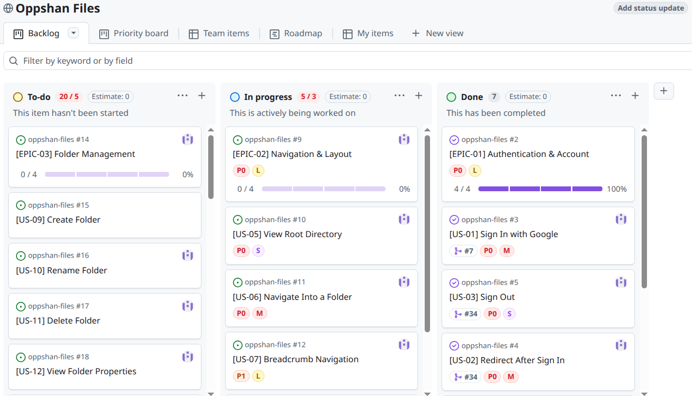

### Branch and pull request convention

I work one feature branch per epic, created from the epic's GitHub issue sidebar, with names following the
pattern `<issue#>-epic-XX-<slug>` (for example, `19-epic-04-file-management`). EPIC-01 is the exception: it
shipped as two story-level branches (`3-us-01-sign-in-with-google` and `4-us-02-redirect-after-sign-in`) because
the epic was small enough to land in two clean PRs. Commits reference the parent issue with the format
`refs #<n> <description>`. Pull request titles match the branch (e.g., `EPIC-04: File Management`); when an epic
is large enough to ship in multiple PRs, each one carries a `Part N` suffix. EPIC-07 (Polish & Responsiveness)
spanned eight parts. Because every branch is created from an issue sidebar, GitHub keeps the PR linked in the
originating issue's Development panel, so merging auto-closes the issue and moves the card to Done. Merge commits
use the prefix `refs #<n> Merged EPIC-0x: <description>`.

### Sprint plan

I organized the project into seven sprints targeting a **May 9, 2026** submission deadline.

| Sprint | Window          | Epic                                                                                           | User Stories                                                                                                                                  | Status                                                                                                              |
|--------|-----------------|------------------------------------------------------------------------------------------------|-----------------------------------------------------------------------------------------------------------------------------------------------|---------------------------------------------------------------------------------------------------------------------|
| 1      | Mar 25 – Apr 4  | [[EPIC-01]](https://github.com/warrenmnocos/oppshan-files/issues/2) Authentication and Account | [[US-01]](https://github.com/warrenmnocos/oppshan-files/issues/3) through [[US-04]](https://github.com/warrenmnocos/oppshan-files/issues/6)   |   |
| 2      | Apr 5 – Apr 11  | [[EPIC-02]](https://github.com/warrenmnocos/oppshan-files/issues/9) Navigation and Layout      | [[US-05]](https://github.com/warrenmnocos/oppshan-files/issues/10) through [[US-08]](https://github.com/warrenmnocos/oppshan-files/issues/13) |   |
| 3      | Apr 12 – Apr 18 | [[EPIC-03]](https://github.com/warrenmnocos/oppshan-files/issues/14) Folder Management         | [[US-09]](https://github.com/warrenmnocos/oppshan-files/issues/15) through [[US-12]](https://github.com/warrenmnocos/oppshan-files/issues/18) |  |
| 4      | Apr 19 – Apr 25 | [[EPIC-04]](https://github.com/warrenmnocos/oppshan-files/issues/19) File Management           | [[US-13]](https://github.com/warrenmnocos/oppshan-files/issues/20) through [[US-19]](https://github.com/warrenmnocos/oppshan-files/issues/26) |  |
| 5      | Apr 26 – May 2  | [[EPIC-05]](https://github.com/warrenmnocos/oppshan-files/issues/27) Context Menu              | [[US-20]](https://github.com/warrenmnocos/oppshan-files/issues/28) through [[US-22]](https://github.com/warrenmnocos/oppshan-files/issues/30) |  |
| 6      | May 3 – May 9   | [[EPIC-06]](https://github.com/warrenmnocos/oppshan-files/issues/31) Storage                   | [[US-23]](https://github.com/warrenmnocos/oppshan-files/issues/32) and [[US-24]](https://github.com/warrenmnocos/oppshan-files/issues/33)     |  |
| 7      | May 7 – May 9   | [[EPIC-07]](https://github.com/warrenmnocos/oppshan-files/issues/40) Polish & Responsiveness   | [[US-25]](https://github.com/warrenmnocos/oppshan-files/issues/41) through [[US-28]](https://github.com/warrenmnocos/oppshan-files/issues/44) |  |

### Labels and delivery tiers

Stories are organized by epic and priority tier. Epic labels scope each story to its functional area:
`epic: authentication and account`, `epic: navigation and layout`, `epic: folder management`,
`epic: file management`, `epic: context menu`, `epic: storage`, and `epic: polish and responsiveness`. Priority
labels show how important each story is to ship. Tier assignments are shown in the User Stories table below.

### User Stories

Full acceptance criteria for each story live on the linked GitHub issue.

<table>
  <thead>
    <tr>
      <th>Epic</th>
      <th>User Story</th>
      <th>Tier</th>
      <th>Status</th>
    </tr>
  </thead>
  <tbody>
    <tr>
      <td rowspan="4"><a href="https://github.com/warrenmnocos/oppshan-files/issues/2">[EPIC-01] Authentication and Account</a></td>
      <td><a href="https://github.com/warrenmnocos/oppshan-files/issues/3">[US-01] Sign in with Google</a></td>
      <td>Core</td>
      <td></td>
    </tr>
    <tr>
      <td><a href="https://github.com/warrenmnocos/oppshan-files/issues/4">[US-02] Redirect to root directory after sign-in</a></td>
      <td>Core</td>
      <td></td>
    </tr>
    <tr>
      <td><a href="https://github.com/warrenmnocos/oppshan-files/issues/5">[US-03] Sign out</a></td>
      <td>Core</td>
      <td></td>
    </tr>
    <tr>
      <td><a href="https://github.com/warrenmnocos/oppshan-files/issues/6">[US-04] Profile panel</a></td>
      <td>Enhanced</td>
      <td></td>
    </tr>
    <tr>
      <td rowspan="4"><a href="https://github.com/warrenmnocos/oppshan-files/issues/9">[EPIC-02] Navigation and Layout</a></td>
      <td><a href="https://github.com/warrenmnocos/oppshan-files/issues/10">[US-05] Root directory on login</a></td>
      <td>Core</td>
      <td></td>
    </tr>
    <tr>
      <td><a href="https://github.com/warrenmnocos/oppshan-files/issues/11">[US-06] Navigate by clicking a folder</a></td>
      <td>Core</td>
      <td></td>
    </tr>
    <tr>
      <td><a href="https://github.com/warrenmnocos/oppshan-files/issues/12">[US-07] Breadcrumb navigation</a></td>
      <td>Core</td>
      <td></td>
    </tr>
    <tr>
      <td><a href="https://github.com/warrenmnocos/oppshan-files/issues/13">[US-08] Grid/list view toggle</a></td>
      <td>Enhanced</td>
      <td></td>
    </tr>
    <tr>
      <td rowspan="4"><a href="https://github.com/warrenmnocos/oppshan-files/issues/14">[EPIC-03] Folder Management</a></td>
      <td><a href="https://github.com/warrenmnocos/oppshan-files/issues/15">[US-09] Create folder</a></td>
      <td>Core</td>
      <td></td>
    </tr>
    <tr>
      <td><a href="https://github.com/warrenmnocos/oppshan-files/issues/16">[US-10] Rename folder</a></td>
      <td>Enhanced</td>
      <td></td>
    </tr>
    <tr>
      <td><a href="https://github.com/warrenmnocos/oppshan-files/issues/17">[US-11] Delete folder recursively</a></td>
      <td>Core</td>
      <td></td>
    </tr>
    <tr>
      <td><a href="https://github.com/warrenmnocos/oppshan-files/issues/18">[US-12] Folder properties</a></td>
      <td>Enhanced</td>
      <td></td>
    </tr>
    <tr>
      <td rowspan="7"><a href="https://github.com/warrenmnocos/oppshan-files/issues/19">[EPIC-04] File Management</a></td>
      <td><a href="https://github.com/warrenmnocos/oppshan-files/issues/20">[US-13] Upload via button</a></td>
      <td>Core</td>
      <td></td>
    </tr>
    <tr>
      <td><a href="https://github.com/warrenmnocos/oppshan-files/issues/21">[US-14] Upload via drag-and-drop</a></td>
      <td>Enhanced</td>
      <td></td>
    </tr>
    <tr>
      <td><a href="https://github.com/warrenmnocos/oppshan-files/issues/22">[US-15] Reject oversized files</a></td>
      <td>Core</td>
      <td></td>
    </tr>
    <tr>
      <td><a href="https://github.com/warrenmnocos/oppshan-files/issues/23">[US-16] Download</a></td>
      <td>Core</td>
      <td></td>
    </tr>
    <tr>
      <td><a href="https://github.com/warrenmnocos/oppshan-files/issues/24">[US-17] Rename file</a></td>
      <td>Enhanced</td>
      <td></td>
    </tr>
    <tr>
      <td><a href="https://github.com/warrenmnocos/oppshan-files/issues/25">[US-18] Delete file</a></td>
      <td>Core</td>
      <td></td>
    </tr>
    <tr>
      <td><a href="https://github.com/warrenmnocos/oppshan-files/issues/26">[US-19] File properties</a></td>
      <td>Enhanced</td>
      <td></td>
    </tr>
    <tr>
      <td rowspan="3"><a href="https://github.com/warrenmnocos/oppshan-files/issues/27">[EPIC-05] Context Menu</a></td>
      <td><a href="https://github.com/warrenmnocos/oppshan-files/issues/28">[US-20] File context menu</a></td>
      <td>Enhanced</td>
      <td></td>
    </tr>
    <tr>
      <td><a href="https://github.com/warrenmnocos/oppshan-files/issues/29">[US-21] Folder context menu</a></td>
      <td>Enhanced</td>
      <td></td>
    </tr>
    <tr>
      <td><a href="https://github.com/warrenmnocos/oppshan-files/issues/30">[US-22] Empty-space context menu</a></td>
      <td>Enhanced</td>
      <td></td>
    </tr>
    <tr>
      <td rowspan="2"><a href="https://github.com/warrenmnocos/oppshan-files/issues/31">[EPIC-06] Storage</a></td>
      <td><a href="https://github.com/warrenmnocos/oppshan-files/issues/32">[US-23] Storage usage bar</a></td>
      <td>Polish</td>
      <td></td>
    </tr>
    <tr>
      <td><a href="https://github.com/warrenmnocos/oppshan-files/issues/33">[US-24] Quota enforcement</a></td>
      <td>Polish</td>
      <td></td>
    </tr>
    <tr>
      <td rowspan="4"><a href="https://github.com/warrenmnocos/oppshan-files/issues/40">[EPIC-07] Polish & Responsiveness</a></td>
      <td><a href="https://github.com/warrenmnocos/oppshan-files/issues/41">[US-25] Spacing and scale consistency</a></td>
      <td>Polish</td>
      <td></td>
    </tr>
    <tr>
      <td><a href="https://github.com/warrenmnocos/oppshan-files/issues/42">[US-26] Mobile-first layout</a></td>
      <td>Polish</td>
      <td></td>
    </tr>
    <tr>
      <td><a href="https://github.com/warrenmnocos/oppshan-files/issues/43">[US-27] Touch-friendly interactions</a></td>
      <td>Polish</td>
      <td></td>
    </tr>
    <tr>
      <td><a href="https://github.com/warrenmnocos/oppshan-files/issues/44">[US-28] Documentation update</a></td>
      <td>Polish</td>
      <td></td>
    </tr>
  </tbody>
</table>

---

## Tech Stack

The stack at a glance:

| Layer              | Technology                                                              | Notable capability used                                                                                                               |
|--------------------|-------------------------------------------------------------------------|---------------------------------------------------------------------------------------------------------------------------------------|
| Backend framework  | **Quarkus 3.34.3** on **Java 25** (Oracle GraalVM)                      | Every JAX-RS handler runs on a **virtual thread** via custom `VirtualThreadServletExtension`                                          |
| Persistence        | **Hibernate ORM** + **Jakarta Data** repositories                       | Custom **Hibernate `UserType`** for transparent AES/CTR encryption; **recursive-CTE `@NamedNativeQuery`** for tree walks              |
| Cryptography       | **Java Cryptography Architecture (JCA/JCE)**                            | **AES/CTR/NoPadding** + per-file 16-byte IV from `SecureRandom`; key via **PBKDF2WithHmacSHA256** (1M iterations)                     |
| Database           | **PostgreSQL 18** + **Flyway**                                          | Large Objects for file content; `BEFORE DELETE` trigger calling `lo_unlink`; UUID v7 primary keys                                     |
| Authentication     | **Quarkus OIDC** + **Google OAuth 2.0**                                 | HTTP-only cookies, encrypted token state, `@SessionScoped` user cache with `@Lock` guards                                             |
| Design & UX        | **Figma Make** prototype + per-user-story wireframe mockups             | Interactive click-through prototype mirrors 1:1 the screens the app implements; one wireframe per acceptance criterion                |
| Frontend framework | **Angular 21**                                                          | Signals-first state, standalone components, `@if`/`@for` control flow, **hand-wired two-way data binding**                            |
| Reactive plumbing  | **RxJS**                                                                | `Subject`-backed event bus exposing typed `Observable` channels for the CQRS event/listener pattern                                   |
| Build              | **Maven** + **frontend-maven-plugin**                                   | One `./mvnw package` compiles the Angular bundle and packages it with the backend into a single artifact                              |
| Production binary  | **Oracle GraalVM 25** native image                                      | ARM64-tuned with `-march=armv8-a+aes+lse` and G1 GC; sub-100 ms startup                                                               |
| Quality            | **Quarkus Dev Services** + **Testcontainers** + **JaCoCo** + **Qodana** | Real PostgreSQL 18 + Keycloak per test run; coverage minimums enforced; static analysis on every PR                                   |
| Project management | **GitHub Projects** + **Issues** + **Milestones**                       | Web-based Agile board: seven sprints, seven epics, 28 user stories, three priority tiers                                              |
| Source control     | **GitHub** repository with feature branches and pull requests           | Branches created from the issue sidebar; merging a PR auto-closes the linked issue and moves the card to Done                         |
| CI/CD              | **GitHub Actions** + **OIDC federation to AWS STS**                     | Three workflows; native ARM64 binary built on `ubuntu-24.04-arm`; no long-lived AWS keys                                              |
| Hosting            | **AWS EC2 t4g.small** (Graviton 2 ARM64) on **Amazon Linux 2023**       | Single instance with PostgreSQL 18 on the same host                                                                                   |
| Edge & TLS         | **Caddy** + **Let's Encrypt** + **AWS Route 53**                        | **Route 53** holds the `A` record and `CAA` lock; wildcard `*.oppshan.com` cert acquired via DNS-01; **Caddy** terminates TLS, no ALB |
| Operations         | **AWS SSM Session Manager** + **SSM Run Command**                       | Replaces SSH; deploys without port 22 ever being exposed                                                                              |

The backend runs on **Quarkus 3.34.3** with **Java 25** (Oracle GraalVM). **JAX-RS** endpoints run on the **Undertow**
servlet container, but I swapped out the worker pool at deployment time with `VirtualThreadServletExtension` so
every request handler runs on a **virtual thread**. Blocking **JDBC** and `InputStream` reads no longer pin
a platform thread. **Hibernate ORM** validates the **Flyway**-managed schema at startup; breadcrumb walks
and directory totals use `@NamedNativeQuery` with recursive **CTE**s rather than row-by-row navigation. A custom Hibernate `UserType`
(`EncryptedBlobUserType`) sits at the persistence boundary and encrypts/decrypts file content transparently. The
service and endpoint layers never see ciphertext. Google sign-in goes through the Quarkus **OpenID Connect** extension,
and Quarkus Dev Services spins up ephemeral **PostgreSQL** and Keycloak containers for the test profile.

The frontend is **Angular 21**, standalone-components only, signals-first. State lives in `signal()` and
`computed()`; component boundaries use `input()` and `output()`. **Two-way data binding** is wired explicitly via
`[ngModel]` / `(ngModelChange)` against a writable signal. I avoided `model()` on purpose, since the input/output
pair it generates costs you whether or not the parent ever two-way binds. Reactive lists, dialog visibility, and
notifications all use the `@if` / `@for` control flow instead of `*ngIf` / `*ngFor`; routes are lazy-loaded with
`loadComponent`; and `class-transformer` hydrates DTOs with type information preserved. At the center sits a custom
`MessageBusService` **event bus**, built on an **RxJS** `Subject` that exposes typed `Observable` channels.
Dedicated single-responsibility listeners subscribe to those channels, keeping mutation paths separate from read paths
(CQRS).

**Maven** performs the build. The `frontend-maven-plugin` compiles the Angular project and drops the bundle into
`src/main/resources/META-INF/resources/`, where Quarkus picks it up and serves it as static content. The production
target is a **GraalVM native image** for ARM64. **JaCoCo** tracks test coverage and **JetBrains Qodana** runs
static analysis on every PR.

The application runs on a single **AWS EC2 t4g.small** (Graviton 2 ARM64) instance with **Amazon Linux 2023** and
**PostgreSQL 18 on the same host**. Caddy terminates TLS and proxies to Quarkus on localhost. DNS goes through
**AWS Route 53** with an A record pointing to a static EIP.

---

## Architecture

The Angular SPA and the Quarkus REST API are served from the same domain (`files.oppshan.com`) as a single origin.
That removes CORS from the picture entirely and means there's no separate CDN or frontend host to manage.

### Component architecture

The component diagram below shows the internal layers of the application.

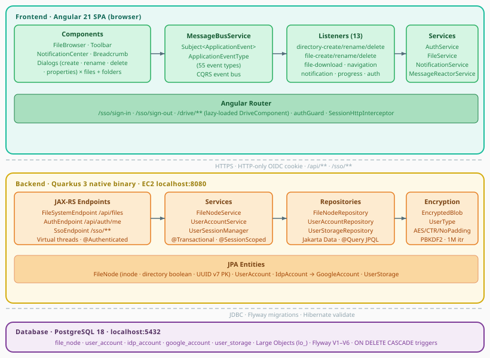

The **frontend** is an Angular 21 SPA structured around a **central `MessageBusService` event bus**. User actions
fire `*Initiated` events; dialogs escalate them to `*Confirmed` commands; dedicated **single-responsibility
listeners** receive those commands, call the relevant service, and emit `*Succeeded` or `*Failed` outcomes.
`AuthService` and `FileService` make the HTTP calls; `NotificationService` drives the `NotificationCenter`
component. The `SessionHttpInterceptor` handles 499 session-expiry responses by redirecting to sign-in.

The **backend** is a Quarkus 3 native binary. Three JAX-RS endpoint classes delegate to three services:
`FileNodeService` does all file-system mutations inside a single `@Transactional` boundary, `UserAccountService`
creates users on the OIDC callback, and `UserSessionManager` caches the authenticated user for the duration of
the HTTP session (with read/write locking around the cache). The services lean on three Jakarta Data
repositories (`FileNodeRepository`, `UserAccountRepository`, and `IdpAccountRepository`) that mix JPQL queries
with **named native queries for recursive CTEs** (breadcrumbs and directory statistics). `EncryptedBlobUserType`
sits below the stack and quietly encrypts and decrypts file content as it crosses the Hibernate boundary, prepending
a **per-file IV** to each Large Object. Every JAX-RS handler runs on a **virtual thread** via
`VirtualThreadServletExtension`, so blocking JDBC and streaming I/O cost nothing on the platform-thread side.

**PostgreSQL 18** holds all state: the unified `file_node` inode table (directories and files share one schema,
distinguished by a `directory` boolean), the user domain tables, and PostgreSQL Large Objects for encrypted file
content. A `BEFORE DELETE` trigger calls `lo_unlink` on each Large Object to reclaim storage when a file node is
deleted. Flyway manages schema migrations; Hibernate validates the schema on startup.

### Deployment architecture

#### Minimal deployment

The deployment diagram below shows the full request path through the AWS infrastructure.

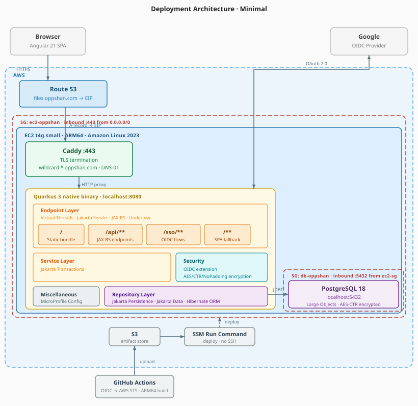

The application runs on a single **EC2 t4g.small** (Graviton 2 ARM64) instance. **Caddy** terminates TLS on port 443
using a wildcard `*.oppshan.com` certificate obtained automatically from Let's Encrypt via DNS-01 challenge against
Route 53, then proxies plain HTTP to **Quarkus** on `localhost:8080`. Quarkus dispatches requests across four routing
zones: `/` serves the pre-compiled Angular bundle, `/api/**` routes to JAX-RS endpoints, `/sso/**` drives the OIDC
sign-in and sign-out flows with Google as the identity provider, and any remaining URL falls through to
`FrontendRoutesFilter` which returns `/index.html` so the Angular router owns deep-link navigation. All data is
persisted in **PostgreSQL 18** running on the same instance. Operator access uses **SSM Session Manager**, so no port 22
is exposed and no SSH key pair is needed. The CI/CD pipeline (GitHub Actions building a GraalVM native binary on an
ARM64 runner, uploading to S3, and deploying via **SSM Run Command**) is shown at the bottom of the diagram.

#### Production deployment

The current deployment is intentionally minimal: a single EC2 instance with on-instance PostgreSQL is sufficient
and cost-effective for a university project. A production-grade deployment serving real traffic would replace
each single point of failure with a managed, multi-AZ equivalent.

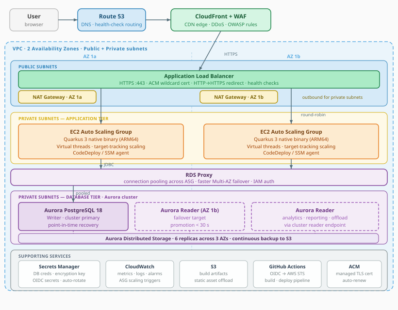

**Networking.** The VPC spans two Availability Zones with separate public and private subnets in each. Only the
ALB sits in the public subnets; the application and database tiers are fully isolated in private subnets with no
direct inbound internet access. A NAT Gateway in each public subnet provides outbound connectivity for the private
tiers (OS updates, SSM agent, Secrets Manager API calls).

**Edge and TLS.** **CloudFront** sits in front of the ALB and serves as both a CDN (caching the Angular static
bundle at edge locations worldwide) and a WAF attachment point (OWASP managed rule group blocks SQLi, XSS, and
common scanners before traffic reaches the origin). **ACM** issues and auto-renews the TLS certificate; the ALB
terminates HTTPS and forwards plain HTTP to the instances, eliminating all certificate management from the
application tier.

**Application tier.** An **Auto Scaling Group** runs the Quarkus native binary across both AZs. The ASG uses a
target-tracking policy on ALB request count per target so capacity scales in and out automatically under load.
The ALB performs health checks against the Quarkus health endpoint and routes around failed instances. Blue/green
or rolling deployments via **CodeDeploy** replace instances without downtime; the GitHub Actions pipeline uploads
the native binary to S3, then triggers the deployment group.

**Database tier.** **Amazon Aurora** for PostgreSQL 18 runs as a cluster: one writer plus readers in the second
AZ, all connected to a single **distributed storage volume** that is **replicated six ways across three AZs** at
the storage layer. A write is durable as soon as four of those six storage nodes acknowledge, which is what lets
Aurora skip instance-to-instance synchronous replication entirely. If the writer dies, **a reader gets promoted
in about 30 seconds** and the cluster endpoint flips over. The application never has to know. Extra readers in the
same cluster soak up analytics and reporting traffic through the read endpoint (round-robin across healthy
readers), and because every reader is reading from the same shared storage, replica lag is sub-second instead of
"however long it takes to catch up to a primary". Automated backups, continuous incremental backup to S3 with
point-in-time recovery, storage auto-scaling, and Performance Insights take care of everything that on-instance
PostgreSQL would force you to do by hand. **RDS Proxy** sits between the ASG and the cluster: it multiplexes
database connections so a sudden scale-out doesn't exhaust the connection pool, and it shortens failover time by
keeping warm connections through promotions.

**Object storage.** A future iteration could move file content out of the database and into **S3**. Quarkus would
keep its existing AES/CTR/NoPadding encryption pipeline and stream the ciphertext straight to a private bucket; the
database would shrink to metadata plus an S3 object key. This trades the convenience of a single transactional store
for cheaper bytes, lower instance memory pressure during large reads, and S3's eleven-nines object durability. The
current PostgreSQL Large Object path stays the default; the swap happens at the persistence boundary.

**Secrets.** **AWS Secrets Manager** stores the database password, OIDC client credentials, and the encryption
passphrase. Secrets are fetched at startup via the Quarkus AWS Secrets extension and rotated automatically;
nothing sensitive lives in environment files or SSM Parameter Store plain text.

**Observability.** **CloudWatch** collects application logs (structured JSON from Quarkus), ALB access logs, Aurora
Performance Insights metrics, and ASG instance-level metrics. Alarms on 5xx rate, p99 latency, and CPU drive the
auto-scaling policy and page on-call via SNS.

| Concern        | Minimal deployment                 | Production deployment                             |
|----------------|------------------------------------|---------------------------------------------------|
| TLS            | Caddy + Let's Encrypt DNS-01       | ACM cert on ALB, auto-renewed                     |
| Availability   | Single EC2 instance                | ASG across 2 AZs, ALB health checks               |
| Database       | On-instance PostgreSQL             | Aurora cluster (writer + readers, shared storage) |
| File content   | PostgreSQL Large Objects           | Optional: S3 bucket (Aurora holds metadata)       |
| Database proxy | None                               | RDS Proxy (connection pooling, faster failover)   |
| Scaling        | Manual resize                      | Target-tracking ASG on ALB RPS                    |
| Secrets        | SSM Parameter Store                | Secrets Manager with auto-rotation                |
| CDN / WAF      | None                               | CloudFront + WAF OWASP rules                      |
| Observability  | SSM Session Manager + systemd logs | CloudWatch Logs, metrics, alarms                  |

---

## Frontend Architecture

### Event bus and reactive pattern

I built the Angular frontend around a central `MessageBusService`, a single observable event stream. Every
mutation flows through the bus:

1. A user action fires an `*Initiated` event with a context payload.
2. A dialog (if needed) fires a `*Confirmed` command event after user confirmation.
3. A **listener** receives the command, calls the relevant service method, and fires `*Succeeded` or `*Failed`.
4. Downstream listeners react to the outcome: refreshing directory contents, surfacing notifications, updating
   progress entries.

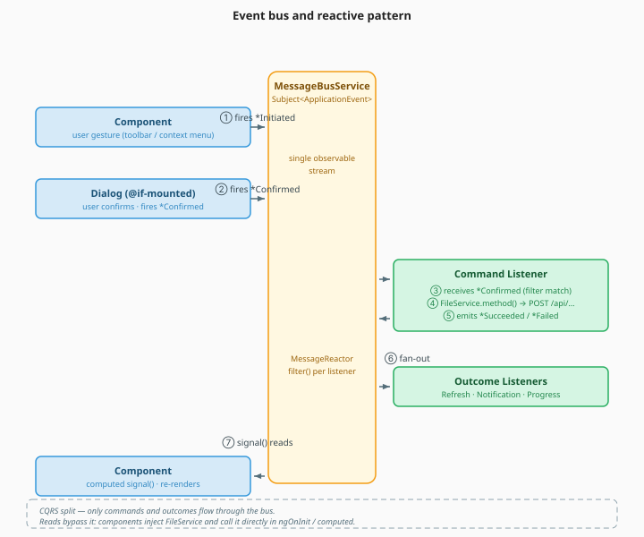

**Listeners are single-responsibility and output-only.** Each listener receives one event type and emits event
types as its only output. A listener that performs an HTTP call must not also mutate service state directly; those
concerns are split across dedicated listeners. For example, `FileCreateConfirmedApplicationEventListener` fires
upload lifecycle events (`FileUploadInitiated`, `FileUploadProgressUpdated`, `FileUploadSucceeded`,
`FileUploadFailed`), and a separate `OperationProgressApplicationEventListener` consumes both upload and
download progress events and translates them into `NotificationService` calls.

Listeners are registered in `app.config.ts` as multi-providers of the `MESSAGE_LISTENERS` injection token, and
`MessageReactorService` fans the event stream out to each listener's filter.

### CQRS split

- **Commands (mutations) → bus via listeners.** Components fire `*Confirmed` with a command payload; a listener
  calls the relevant service and emits `*Succeeded` or `*Failed`.
- **Queries (reads) → direct service calls.** Components inject `FileService` and call it in `ngOnInit` or `computed`.

### Notification system

All user-facing feedback flows through a unified `NotificationService` and is rendered by a single
`NotificationCenter` component fixed at the bottom-right of the screen. Two notification types share a common
`ApplicationNotification` base interface:

- **`MessageNotification`**: auto-dismissing toast for operation outcomes and errors. It carries a `MessageCode`
  translation key, optional `params: Record<string, unknown>` for interpolation, and severity derived from the key
  prefix (`messages.errors.*` → error, `messages.info.*` → info).
- **`ProgressNotification`**: live progress entry for long-running operations. It carries a `label` translation
  key, optional `params`, and a `progress: number` (0–100). Feature-agnostic: file uploads, future downloads, and any
  other progress-emitting operation use the same type. Entries are removed on completion; failures are removed
  immediately and surface as `MessageNotification` toasts.

The `NotificationCenter` renders progress entries in a collapsible section and toasts in a separate stack within
the same panel.

### Dialog pattern

Dialogs are siblings in the component tree, mounted via an `@if` gate on `applicationEvenTypeSignal()`:

```html
@if (messageBusService.applicationEvenTypeSignal() === ApplicationEventType.DirectoryCreateInitiated) {
<app-directory-creation-dialog/>
}
```

A trigger fires `*Initiated` with a context payload; the gate mounts the dialog; the dialog reads the payload via
`computed(() => bus.applicationEventSignal().payload as ContextType)`; confirming fires `*Confirmed`, cancelling
fires `*Cancelled`; any other event collapses the gate and unmounts the dialog.

### Context menu pattern

The context menu uses the same `@if`-on-bus-state mount as dialogs, just with its own lifecycle pair. A kebab
click, a right-click on a row, a long-press on touch, or a right-click on empty space all fire `ContextMenuShown`
with `{target, position, parentUuid}`. The gate mounts `<app-file-context-menu/>`. Outside pointerdown, `Escape`,
scroll, or window resize fires `ContextMenuHidden` and the menu disappears.

What the menu shows depends on `target`: `null` (empty space) gets Refresh / New folder / Upload file, a folder
gets Open / Rename / Properties / Delete, a file gets Download / Rename / Properties / Delete. The interesting
part is that picking an item doesn't introduce a new domain event; it just re-fires an existing one. Rename
fires `DirectoryRenameInitiated` or `FileRenameInitiated`, Delete fires `*DeletionInitiated`, Properties fires
`*PropertiesShown`, Open fires `DirectoryNavigationInitiated`, Refresh fires `DirectoryRefreshInitiated`, New
folder fires `DirectoryCreateInitiated`, Download fires `FileDownloadConfirmed`. The one exception is Upload:
the menu has no idea how upload actually works, so it fires a thin `FileUploadPickerShown` bridge event and
`FileBrowser` (which owns the file picker) decides what to do with it.

Layout flips at roughly 599 px (`37.4375rem`) via `window.matchMedia('(max-width: 37.4375rem)')`. Above the
breakpoint, the menu floats at the trigger coordinates and clamps itself to the viewport (via
`getBoundingClientRect` after first render). Below it, the menu renders as a full-width bottom sheet over a backdrop.

### Standalone components and signals

Every component is `standalone: true` with no NgModules. State is held in signals (`signal`, `input`,
`input.required`, `computed`, `toSignal` for `Observable` interop); RxJS lives at the edges (HTTP, the bus
`Subject`, route URL streams). Subscriptions are torn down in `ngOnDestroy`.

### File layout

```
src/main/angular/src/app/
├── app.config.ts          # providers, listener registration, route loading
├── app.routes.ts          # /drive/**, /sso/sign-in, /sso/sign-out
├── pages/                 # Drive, SignIn, SignOut (all lazy-loaded)
├── components/            # Toolbar, Footer, FileBrowser, Breadcrumb, FileContextMenu,
│                          # NotificationCenter, ErrorState, ProfileDialog,
│                          # FilePreviewDialog, folder dialogs (create, rename,
│                          # delete, properties), file dialogs (rename, delete,
│                          # properties)
├── services/              # AuthService, FileService, MessageBusService, NotificationService,
│                          # MessageReactorService, JsonMapperService
├── listeners/             # listener classes + AbstractApplicationEventListener +
│                          # MessageListener interface
├── models/                # ApplicationEvent envelope, ApplicationEventType enum,
│                          # MessageCode, ContextMenuItem, command interfaces, outcome
│                          # interfaces, view DTOs
└── misc/                  # auth.guard, SessionHttpInterceptor, pipes, utils
```

---

## Backend Architecture

### Endpoint structure

I organized REST resources under three roots. `AuthEndpoint` exposes `GET /api/auth/me` to return the current
`UserAccountView` (or 401). `SsoEndpoint` provides the OIDC entry, callback, and sign-out flows under `/sso/...`.
`FileSystemEndpoint` exposes the unified file system surface under `/api/files`. See [API Reference](#api-reference)
for a complete list.

### Polymorphic file/folder handling

The `FileNode` entity is a unified inode-style record: a row may represent either a file or a directory, controlled
by the `directory` boolean. As a result, several endpoints are polymorphic. `PATCH /api/files/{uuid}` dispatches to
`renameDirectory` or `renameFile`; `DELETE /api/files/{uuid}` dispatches to `deleteDirectory` or `deleteFile`;
`GET /api/files/{uuid}/properties` dispatches to `DirectoryPropertiesView` or `RegularFilePropertiesView`. The
endpoint and the Angular app both treat the type as runtime data on the same record, so listing a directory
returns a `FileNodeView` list mixing both kinds.

### Streaming uploads on virtual threads

The application runs on **RESTEasy Classic** backed by the **Undertow** servlet container.
`VirtualThreadServletExtension` is registered via `META-INF/services/io.undertow.servlet.ServletExtension` and, at
deployment time, replaces Undertow's worker and async executors with a `Executors.newThreadPerTaskExecutor(...)`
backed by `Thread.ofVirtual()`. Every JAX-RS handler (including the upload endpoint) therefore executes on a
named virtual thread (`undertow-virtual-thread-N`); no per-method annotation is required. The handler reads the
servlet `InputStream` directly into the encryption pipeline. Backpressure propagates: if the application reads
slower than the network delivers, Undertow stops draining the connection's receive buffer, and TCP backpressure
reaches the client. The file is never buffered in memory or spooled to a temp file. See
[File Streaming and Encryption](#file-streaming-and-encryption) for the full pipeline.

### Hibernate UserType for transparent encryption

`EncryptedBlobUserType` is a Hibernate `UserType` that intercepts JDBC `Blob` reads and writes for the
`FileNode.content` column. On write, it wraps the incoming stream in an `IncomingBlob` that prepends a fresh 16-byte
IV and chains a `CipherInputStream` (AES/CTR/NoPadding). On read, it wraps the JDBC stream in an `OutgoingBlob`
that consumes the IV and chains a decryption cipher. Service code, repository code, and endpoint code never see
plaintext or ciphertext logic; they treat content as a `Blob`.

### Named native queries with CTEs

Three operations require recursive traversal of the file tree. Rather than fetching the tree row-by-row, each is
implemented as a `@NamedNativeQuery` with a recursive Common Table Expression and a custom
`@SqlResultSetMapping` to a record:

- **`FileNode.GET_DIRECTORY_STATISTICS`**: recursive CTE descends from a target directory and aggregates
  `folderCount`, `fileCount`, `totalSizeBytes`. Result mapped to `DirectoryStatistics`.
- **`FileNode.GET_BREADCRUMBS_BY_FILE_NODE_UUID`**: recursive CTE walks up the parent chain from a target node.
  Result mapped to a list of `BreadcrumbView`.
- **`FileNode.GET_BREADCRUMBS_BY_PATH`**: splits a slash-separated path string and walks down the tree, returning
  the breadcrumb trail for the resolved directory.

### Session-scoped user account caching

`SessionScopedUserSessionManager` is a `@SessionScoped` `@Alternative @Priority(APPLICATION)` bean that wraps the
OIDC delegate and caches `UserAccountView` for the lifetime of the HTTP session. `getSessionUserAccount()` and
`signOut()` are guarded by `@Lock(Type.WRITE)`; `isSignedOut()` by `@Lock(Type.READ)`. The cache is reset by
`refreshSessionUserAccount()`, which the `FileSystemEndpoint` calls after every successful upload and delete so the
next `GET /api/auth/me` returns fresh `usedStorageBytes` for the toolbar storage display.

### File layout

```
src/main/java/com/oppshan/files/
├── auth/        # OIDC session management, sign-in/out endpoints, multi-tenant resolver
├── common/      # auditable entity base, route filter, virtual-thread extension, write-repo mixin
├── config/      # ApplicationStorage @ConfigMapping
├── exception/   # MessageCode enum, BusinessException factories, JAX-RS mapper, ErrorResponse
├── file/        # FileNode entity, UserStorage, repository, service, endpoint, view types, encryption
└── user/        # UserAccount, IdpAccount, GoogleAccount, services, repositories
```

---

## Data Model

The application uses five core entities organized across two domains. All primary keys are UUID v7 (time-ordered)
to keep B-tree indexes locality-friendly while avoiding integer-ID enumeration leaks.

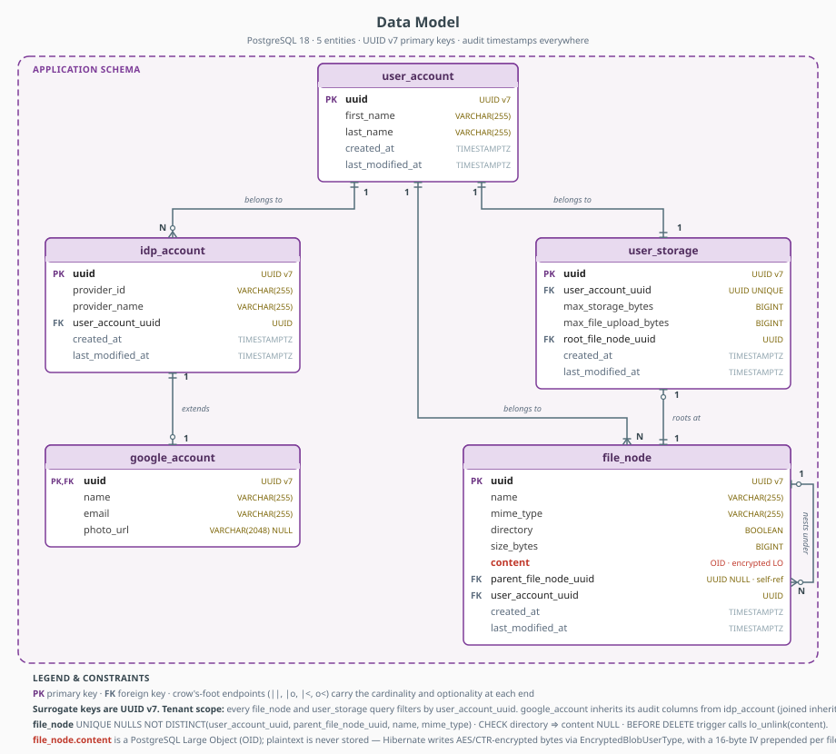

### User domain

**`UserAccount`** represents a platform user; it owns one or more `IdpAccount` rows and exactly one
`UserStorage` row.

**`IdpAccount`** is the abstract base for identity-provider accounts, using JPA joined-inheritance. The
abstraction exists so adding GitHub or Microsoft is cheap: a new `IdpAccount` subclass plus an OIDC
configuration entry, with no schema change to the file or user core.

**`GoogleAccount`** extends `IdpAccount` with the Google-specific fields below. It lives in a separate
`google_account` table joined to `idp_account` by primary key, with indexes on `name` and `email`.

<table>
<colgroup>
<col style="width: 22%;">
<col style="width: 20%;">
<col style="width: 22%;">
<col style="width: 36%;">
</colgroup>
<thead>
<tr><th>Type</th><th>Property</th><th>Property type</th><th>Description</th></tr>
</thead>
<tbody>
<tr><td rowspan="7"><code>UserAccount</code></td><td><code>uuid</code></td><td><code>UUID</code></td><td>Primary key (UUID v7); <code>NOT NULL</code>, not updatable, <code>@NotNull</code></td></tr>
<tr><td><code>firstName</code></td><td><code>String</code></td><td>Given name from the OIDC <code>given_name</code> claim; nullable (the claim is OIDC-optional); indexed via the composite <code>idx_user_account_first_name (first_name, last_name)</code></td></tr>
<tr><td><code>lastName</code></td><td><code>String</code></td><td>Family name from the OIDC <code>family_name</code> claim; nullable (the claim is OIDC-optional); indexed via the composite <code>idx_user_account_last_name (last_name, first_name)</code></td></tr>
<tr><td><code>idpAccounts</code></td><td><code>SortedSet&lt;IdpAccount&gt;</code></td><td>One-to-many; <code>@NotNull</code>, <code>cascade=ALL</code>, <code>orphanRemoval=true</code>, <code>FetchType.LAZY</code></td></tr>
<tr><td><code>userStorage</code></td><td><code>UserStorage</code></td><td>One-to-one; <code>@NotNull</code>, <code>cascade=ALL</code>, <code>orphanRemoval=true</code>, <code>FetchType.EAGER</code></td></tr>
<tr><td><code>createdAt</code></td><td><code>Instant</code></td><td>Audit timestamp set on <code>@PrePersist</code>; <code>NOT NULL</code>, not updatable, <code>@NotNull</code>; indexed (<code>idx_user_account_created_at</code>)</td></tr>
<tr><td><code>lastModifiedAt</code></td><td><code>Instant</code></td><td>Audit timestamp bumped on <code>@PrePersist</code> + <code>@PreUpdate</code>; <code>NOT NULL</code>, <code>@NotNull</code></td></tr>
<tr><td rowspan="6"><code>IdpAccount</code><br><em>(abstract, JOINED inheritance)</em></td><td><code>uuid</code></td><td><code>UUID</code></td><td>Primary key (UUID v7); <code>NOT NULL</code>, not updatable, <code>@NotNull</code></td></tr>
<tr><td><code>providerId</code></td><td><code>String</code></td><td>External identifier from the IdP (e.g., Google <code>sub</code>); <code>NOT NULL</code>, <code>@NotEmpty</code>, not updatable; part of <code>(provider_id, provider_name, user_account_uuid)</code> unique constraint</td></tr>
<tr><td><code>providerName</code></td><td><code>String</code></td><td>Provider name (e.g., <code>"google"</code>); <code>NOT NULL</code>, <code>@NotEmpty</code>, not updatable; part of <code>(provider_id, provider_name, user_account_uuid)</code> unique constraint</td></tr>
<tr><td><code>userAccount</code></td><td><code>UserAccount</code></td><td>Many-to-one owning user; <code>NOT NULL</code>, not updatable, <code>@NotNull</code>, <code>FetchType.LAZY</code></td></tr>
<tr><td><code>createdAt</code></td><td><code>Instant</code></td><td>Audit timestamp; <code>NOT NULL</code>, not updatable, <code>@NotNull</code>; indexed (<code>idx_idp_account_created_at</code>)</td></tr>
<tr><td><code>lastModifiedAt</code></td><td><code>Instant</code></td><td>Audit timestamp; <code>NOT NULL</code>, <code>@NotNull</code></td></tr>
<tr><td rowspan="3"><code>GoogleAccount</code><br><em>extends <code>IdpAccount</code></em></td><td><code>name</code></td><td><code>String</code></td><td>Display name from the Google ID token <code>name</code> claim; nullable (claim is OIDC-optional); indexed (<code>idx_google_account_name</code>)</td></tr>
<tr><td><code>email</code></td><td><code>String</code></td><td>Email address from the Google ID token; <code>NOT NULL</code>, <code>@NotEmpty</code> (the <code>email</code> OAuth scope guarantees the claim); indexed (<code>idx_google_account_email</code>)</td></tr>
<tr><td><code>photoUrl</code></td><td><code>String</code></td><td>Avatar URL from the Google ID token <code>picture</code> claim; <code>VARCHAR(2048)</code>, nullable (claim is OIDC-optional)</td></tr>
</tbody>
</table>

### File domain

**`FileNode`** is the unified entity for both files and directories, following an inode-style design. A database
CHECK constraint enforces that directories have null content and zero size while files have non-null content.
The unique constraint `(user_account_uuid, parent_file_node_uuid, name, mime_type) UNIQUE NULLS NOT DISTINCT`
prevents duplicate names within the same parent even at the root level (where `parent_file_node_uuid IS NULL`);
the leading `user_account_uuid` keeps each user's namespace isolated.

**`UserStorage`** tracks each user's quota and points to their root folder.

<table>
<colgroup>
<col style="width: 22%;">
<col style="width: 20%;">
<col style="width: 22%;">
<col style="width: 36%;">
</colgroup>
<thead>
<tr><th>Type</th><th>Property</th><th>Property type</th><th>Description</th></tr>
</thead>
<tbody>
<tr><td rowspan="11"><code>FileNode</code></td><td><code>uuid</code></td><td><code>UUID</code></td><td>Primary key (UUID v7); <code>NOT NULL</code>, not updatable, <code>@NotNull</code></td></tr>
<tr><td><code>name</code></td><td><code>String</code></td><td>Display name; <code>NOT NULL</code>, <code>@NotEmpty</code>; part of <code>(user_account_uuid, parent_file_node_uuid, name, mime_type) UNIQUE NULLS NOT DISTINCT</code></td></tr>
<tr><td><code>mimeType</code></td><td><code>String</code></td><td>MIME type; <code>NOT NULL</code>, <code>@NotEmpty</code>; folders use <code>application/vnd.oppshan-files.folder</code>; part of the same unique constraint</td></tr>
<tr><td><code>directory</code></td><td><code>boolean</code></td><td><code>true</code> for folders, <code>false</code> for regular files; <code>NOT NULL</code>, not updatable</td></tr>
<tr><td><code>sizeBytes</code></td><td><code>long</code></td><td>File size in bytes; <code>NOT NULL</code>, <code>@PositiveOrZero</code>; CHECK enforces <code>0</code> for folders</td></tr>
<tr><td><code>content</code></td><td><code>Blob</code></td><td>Encrypted file content via <code>EncryptedBlobUserType</code>; CHECK enforces null for folders, non-null for files; <code>FetchType.LAZY</code> with <code>@LazyGroup</code></td></tr>
<tr><td><code>parentFileNode</code></td><td><code>FileNode</code></td><td>Many-to-one self-reference; null for the user's root; not updatable, <code>FetchType.LAZY</code>; part of the unique constraint</td></tr>
<tr><td><code>userAccount</code></td><td><code>UserAccount</code></td><td>Many-to-one tenant scope; <code>user_account_uuid NOT NULL</code>, not updatable, <code>@NotNull</code>, <code>FetchType.LAZY</code>; leading column of the unique constraint</td></tr>
<tr><td><code>childFileNodes</code></td><td><code>SortedSet&lt;FileNode&gt;</code></td><td>One-to-many self-reference; <code>@NotNull</code>, <code>cascade=ALL</code>, <code>orphanRemoval=true</code>, <code>FetchType.LAZY</code></td></tr>
<tr><td><code>createdAt</code></td><td><code>Instant</code></td><td>Audit timestamp; <code>NOT NULL</code>, not updatable, <code>@NotNull</code></td></tr>
<tr><td><code>lastModifiedAt</code></td><td><code>Instant</code></td><td>Audit timestamp; <code>NOT NULL</code>, <code>@NotNull</code></td></tr>
<tr><td rowspan="7"><code>UserStorage</code></td><td><code>uuid</code></td><td><code>UUID</code></td><td>Primary key (UUID v7); <code>NOT NULL</code>, not updatable, <code>@NotNull</code></td></tr>
<tr><td><code>userAccount</code></td><td><code>UserAccount</code></td><td>One-to-one owning user; <code>NOT NULL</code>, not updatable, <code>@NotNull</code>, <code>FetchType.LAZY</code></td></tr>
<tr><td><code>maxStorageBytes</code></td><td><code>long</code></td><td>Per-user storage quota in bytes; <code>NOT NULL</code>, <code>@PositiveOrZero</code></td></tr>
<tr><td><code>maxFileUploadBytes</code></td><td><code>long</code></td><td>Per-upload size limit in bytes; <code>NOT NULL</code>, <code>@PositiveOrZero</code></td></tr>
<tr><td><code>rootFileNode</code></td><td><code>FileNode</code></td><td>One-to-one to the user's top-level directory; <code>NOT NULL</code>, not updatable, <code>@NotNull</code>, <code>cascade=ALL</code>, <code>orphanRemoval=true</code>, <code>FetchType.LAZY</code></td></tr>
<tr><td><code>createdAt</code></td><td><code>Instant</code></td><td>Audit timestamp; <code>NOT NULL</code>, not updatable, <code>@NotNull</code></td></tr>
<tr><td><code>lastModifiedAt</code></td><td><code>Instant</code></td><td>Audit timestamp; <code>NOT NULL</code>, <code>@NotNull</code></td></tr>
</tbody>
</table>

### View types

Endpoints return immutable view types, never entities. Most are Java `record`s.
`DirectoryContentsView` is a class with a defensive constructor that null-replaces the children
list. `FileNodePropertiesView` is a sealed interface that `DirectoryPropertiesView` and
`RegularFilePropertiesView` implement, so `GET /api/files/{uuid}/properties` can return either
polymorphically. The TypeScript side mirrors each client-facing view with matching field names,
and `class-transformer` hydrates nested types via `@Type(() => X)`.

<table>
<colgroup>
<col style="width: 22%;">
<col style="width: 20%;">
<col style="width: 22%;">
<col style="width: 36%;">
</colgroup>
<thead>
<tr><th>Type</th><th>Property</th><th>Property type</th><th>Description</th></tr>
</thead>
<tbody>
<tr><td rowspan="12"><code>UserAccountView</code></td><td><code>uuid</code></td><td><code>UUID</code></td><td>User identifier (v7)</td></tr>
<tr><td><code>firstName</code></td><td><code>String</code></td><td>Given name from the IdP; may be null when the <code>given_name</code> OIDC claim is absent</td></tr>
<tr><td><code>lastName</code></td><td><code>String</code></td><td>Family name from the IdP; may be null when the <code>family_name</code> OIDC claim is absent</td></tr>
<tr><td><code>displayName</code></td><td><code>String</code></td><td>Always-non-empty resolved name for UI rendering; backend chains <code>firstName + lastName</code> (trimmed) → Google <code>name</code> claim → email</td></tr>
<tr><td><code>email</code></td><td><code>String</code></td><td>Primary email from the IdP</td></tr>
<tr><td><code>photoUrl</code></td><td><code>String</code></td><td>Avatar URL from the IdP; may be null</td></tr>
<tr><td><code>usedStorageBytes</code></td><td><code>long</code></td><td>Sum of file sizes owned by this user</td></tr>
<tr><td><code>maxStorageBytes</code></td><td><code>long</code></td><td>Per-user storage quota</td></tr>
<tr><td><code>maxFileUploadBytes</code></td><td><code>long</code></td><td>Per-upload size limit</td></tr>
<tr><td><code>rootFileNodeUuid</code></td><td><code>UUID</code></td><td>UUID of the user's top-level directory</td></tr>
<tr><td><code>createdAt</code></td><td><code>Instant</code></td><td>When the account was created</td></tr>
<tr><td><code>lastModifiedAt</code></td><td><code>Instant</code></td><td>When the account was last updated</td></tr>
<tr><td rowspan="4"><code>UserStorageView</code></td><td><code>userAccountUuid</code></td><td><code>UUID</code></td><td>Owner UUID</td></tr>
<tr><td><code>maxFileUploadBytes</code></td><td><code>long</code></td><td>Per-upload size limit</td></tr>
<tr><td><code>maxStorageBytes</code></td><td><code>long</code></td><td>Per-user storage quota</td></tr>
<tr><td><code>totalSizeBytes</code></td><td><code>long</code></td><td>Live sum of file sizes (scalar subquery, internal)</td></tr>
<tr><td rowspan="8"><code>FileNodeView</code></td><td><code>uuid</code></td><td><code>UUID</code></td><td>Node identifier</td></tr>
<tr><td><code>name</code></td><td><code>String</code></td><td>Display name</td></tr>
<tr><td><code>mimeType</code></td><td><code>String</code></td><td>MIME type; folders use <code>application/vnd.oppshan-files.folder</code></td></tr>
<tr><td><code>directory</code></td><td><code>boolean</code></td><td>True for folders, false for regular files</td></tr>
<tr><td><code>sizeBytes</code></td><td><code>long</code></td><td>File size; <code>0</code> for folders</td></tr>
<tr><td><code>parentUuid</code></td><td><code>UUID</code></td><td>Containing folder UUID</td></tr>
<tr><td><code>createdAt</code></td><td><code>Instant</code></td><td>Creation timestamp</td></tr>
<tr><td><code>lastModifiedAt</code></td><td><code>Instant</code></td><td>Last-modified timestamp</td></tr>
<tr><td rowspan="6"><code>DirectoryContentsView</code></td><td><code>uuid</code></td><td><code>UUID</code></td><td>Directory identifier</td></tr>
<tr><td><code>name</code></td><td><code>String</code></td><td>Directory display name</td></tr>
<tr><td><code>parentUuid</code></td><td><code>UUID</code></td><td>Containing folder UUID; null for the user's root</td></tr>
<tr><td><code>breadcrumbViews</code></td><td><code>List&lt;BreadcrumbView&gt;</code></td><td>Trail from the user's root down to this directory</td></tr>
<tr><td><code>childrenFileNodeViews</code></td><td><code>List&lt;FileNodeView&gt;</code></td><td>Sorted child entries (folders first, then files, name-ordered)</td></tr>
<tr><td><code>targetFileUuid</code></td><td><code>UUID</code></td><td>Optional; populated on deep-link navigation so the frontend highlights that entry</td></tr>
<tr><td rowspan="3"><code>BreadcrumbView</code></td><td><code>uuid</code></td><td><code>UUID</code></td><td>Segment identifier</td></tr>
<tr><td><code>name</code></td><td><code>String</code></td><td>Segment display name</td></tr>
<tr><td><code>directory</code></td><td><code>boolean</code></td><td>True for folders; false on the final segment when it resolves to a file</td></tr>
<tr><td rowspan="3"><code>DirectoryStatistics</code></td><td><code>folderCount</code></td><td><code>long</code></td><td>Subdirectories in the subtree</td></tr>
<tr><td><code>fileCount</code></td><td><code>long</code></td><td>Files in the subtree</td></tr>
<tr><td><code>totalSizeBytes</code></td><td><code>long</code></td><td>Sum of all file sizes in the subtree</td></tr>
<tr><td rowspan="7"><code>DirectoryPropertiesView</code></td><td><code>uuid</code></td><td><code>UUID</code></td><td>Folder identifier</td></tr>
<tr><td><code>name</code></td><td><code>String</code></td><td>Folder display name</td></tr>
<tr><td><code>createdAt</code></td><td><code>Instant</code></td><td>Creation timestamp</td></tr>
<tr><td><code>lastModifiedAt</code></td><td><code>Instant</code></td><td>Last-modified timestamp</td></tr>
<tr><td><code>directoryCount</code></td><td><code>long</code></td><td>Subdirectories in the subtree</td></tr>
<tr><td><code>fileCount</code></td><td><code>long</code></td><td>Files in the subtree</td></tr>
<tr><td><code>totalSizeBytes</code></td><td><code>long</code></td><td>Sum of all file sizes in the subtree</td></tr>
<tr><td rowspan="8"><code>RegularFilePropertiesView</code></td><td><code>uuid</code></td><td><code>UUID</code></td><td>File identifier</td></tr>
<tr><td><code>name</code></td><td><code>String</code></td><td>File display name</td></tr>
<tr><td><code>mimeType</code></td><td><code>String</code></td><td>Content MIME type</td></tr>
<tr><td><code>sizeBytes</code></td><td><code>long</code></td><td>Decrypted file size</td></tr>
<tr><td><code>parentUuid</code></td><td><code>UUID</code></td><td>Parent folder UUID</td></tr>
<tr><td><code>parentName</code></td><td><code>String</code></td><td>Parent folder display name</td></tr>
<tr><td><code>createdAt</code></td><td><code>Instant</code></td><td>Creation timestamp</td></tr>
<tr><td><code>lastModifiedAt</code></td><td><code>Instant</code></td><td>Last-modified timestamp</td></tr>
<tr><td rowspan="6"><code>FileDownloadView</code></td><td><code>userAccountUuid</code></td><td><code>UUID</code></td><td>File owner</td></tr>
<tr><td><code>fileNodeUuid</code></td><td><code>UUID</code></td><td>Source file UUID</td></tr>
<tr><td><code>filename</code></td><td><code>String</code></td><td>Filename for <code>Content-Disposition</code></td></tr>
<tr><td><code>mimeType</code></td><td><code>String</code></td><td>Response <code>Content-Type</code></td></tr>
<tr><td><code>sizeBytes</code></td><td><code>long</code></td><td>Response <code>Content-Length</code></td></tr>
<tr><td><code>contentInputStream</code></td><td><code>InputStream</code></td><td>Decrypted plaintext stream piped to <code>StreamingOutput</code></td></tr>
</tbody>
</table>

---

## File Streaming and Encryption

### Upload pipeline

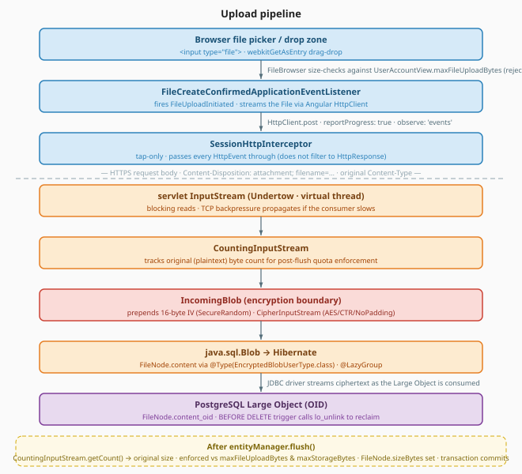

After `entityManager.flush()` forces the stream to be drained, `CountingInputStream.getCount()` yields the file's
original size. The service then verifies the size against `getMaxFileUploadBytes(userAccountUuid)` and the running
total against `getMaxStorageBytes(userAccountUuid)`, failing the transaction with `fileSizeExceeded` or
`fileQuotaExceeded` if either is exceeded. The `FileNode.sizeBytes` field receives the counted value and the
transaction commits atomically. On the client side, `OperationProgressApplicationEventListener` translates
`HttpEventType.UploadProgress` events into `FileUploadProgressUpdated` outcomes so the `NotificationCenter`'s
upload section reflects byte-accurate progress in real time; the final `HttpResponse` becomes either
`FileUploadSucceeded` (which refreshes directory contents and the toolbar storage display) or
`FileUploadFailed` (which surfaces a toast and removes the progress entry).

### Download pipeline

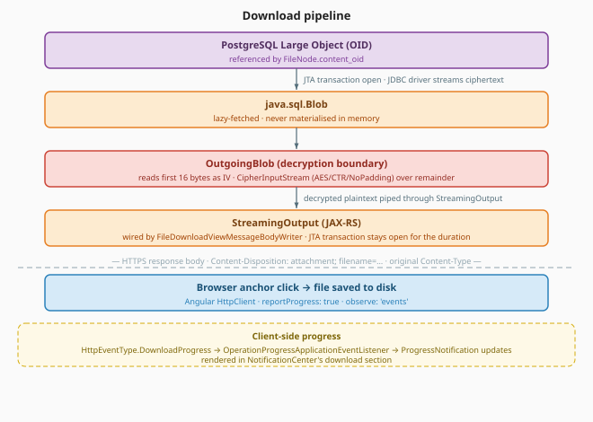

`GET /api/files/{uuid}/download` returns a `FileDownloadViewResolver`. The custom
`FileDownloadViewMessageBodyWriter` opens a JTA transaction, loads the `FileNode`, wraps the `Blob` in an
`OutgoingBlob` that reads the first 16 bytes as the IV, initializes a decryption cipher, and returns a
`CipherInputStream` over the remaining ciphertext. The decrypted plaintext is piped to the HTTP response
through `StreamingOutput`. The transaction stays open for the duration of the download because the Large Object
stream requires an active transaction. On the client side, the Angular `HttpClient` subscribes with
`observe: 'events'` so the `OperationProgressApplicationEventListener` translates `HttpEventType.DownloadProgress`
events into `ProgressNotification` updates rendered in the `NotificationCenter`'s download section.

---

## API Reference

### Public (no authentication)

| Method | Path                                           | Purpose                             |
|--------|------------------------------------------------|-------------------------------------|
| GET    | `/sso/sign-in`                                 | Redirect to OIDC provider list      |
| GET    | `/sso/sign-in/oidc/{idpProviderName}`          | Start OIDC flow with given provider |
| GET    | `/sso/sign-in/oidc/callback/{idpProviderName}` | OIDC callback                       |
| POST   | `/sso/sign-out`                                | Terminate session                   |

### Authenticated (OIDC HTTP-only cookie)

| Method | Path                           | Request body                     | Response body            | Purpose                                                                                              |
|--------|--------------------------------|----------------------------------|--------------------------|------------------------------------------------------------------------------------------------------|
| GET    | `/api/auth/me`                 | —                                | `UserAccountView`        | Current authenticated user; `401` if signed out                                                      |
| GET    | `/api/files/{uuid}/contents`   | —                                | `DirectoryContentsView`  | Directory contents by UUID                                                                           |
| GET    | `/api/files/contents?path=...` | —                                | `DirectoryContentsView`  | Directory contents by slash-separated path; empty path returns the user's root                       |
| POST   | `/api/files`                   | `CreateDirectoryRequest`         | `DirectoryContentsView`  | Create a directory                                                                                   |
| PATCH  | `/api/files/{uuid}`            | `RenameFileNodeRequest`          | `DirectoryContentsView`  | Rename a file or directory                                                                           |
| DELETE | `/api/files/{uuid}`            | —                                | `DirectoryContentsView`  | Delete a file or directory (recursive for directories)                                               |
| GET    | `/api/files/{uuid}/properties` | —                                | `FileNodePropertiesView` | Properties of a file or directory (sealed: `DirectoryPropertiesView` or `RegularFilePropertiesView`) |
| POST   | `/api/files/{uuid}/upload`     | `FileUploadRequest` + raw bytes¹ | `DirectoryContentsView`  | Stream a file into the directory                                                                     |
| GET    | `/api/files/{uuid}/download`   | —                                | binary stream²           | Stream a file out                                                                                    |

¹ `FileUploadRequest` is a `@BeanParam`: the filename comes from `Content-Disposition: attachment; filename=...`
and the MIME type from `Content-Type`. The request body itself is the raw file bytes.
² Decrypted plaintext via `FileDownloadView` → `FileDownloadViewMessageBodyWriter`; sets
`Content-Disposition: attachment` and the original `Content-Type`.

Successful `POST` responses (`/api/files`, `/api/files/{uuid}/upload`) return `201 Created`; other successes
return `200 OK`. Errors come back as `400 Bad Request` with body `{ "messageCode": "messages.errors.<key>" }`
(translated by the Angular app via the i18n table). The Angular app's `SessionHttpInterceptor` watches for `499`
(a custom status used by the OIDC layer to signal session invalidation mid-request) and redirects to sign-in.

---

## Security

### Authentication

All authentication runs through **Google OAuth 2.0** via the Quarkus OIDC extension. The application stores no
passwords. On first login, the backend reads `sub` (Google's unique user identifier), `name`, `email`, and
`picture` from the ID token claims. If no `UserAccount` exists for that `sub`, the backend creates one (a matching
`GoogleAccount`, a `UserStorage` row, and a root `FileNode`) in a single transaction. Subsequent
logins match by Google `sub` and reuse the existing user. Quarkus manages the OIDC session through HTTP-only
cookies, so the Angular app never touches a token directly. Token state in the cookie is encrypted with the
secret in `quarkus.oidc.token-state-manager.encryption-secret`.

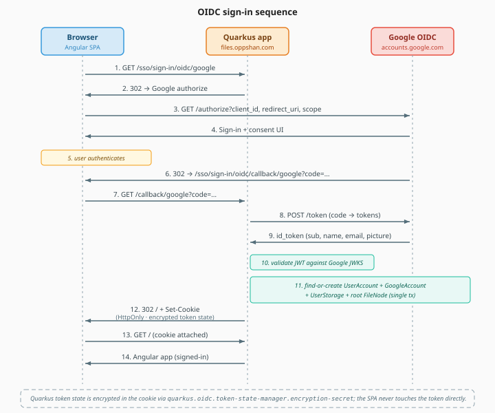

I built the identity-provider abstraction (`IdpAccount` → `GoogleAccount`) so adding more providers is cheap.
Adding GitHub, for example, would mean a new entity extending `IdpAccount`, a claim-extraction lambda, and an OIDC
config entry. Nothing in the user or file core changes.

### File encryption

All uploaded file content is encrypted at rest using **AES/CTR/NoPadding**. Each file gets a unique 16-byte
initialization vector generated by `SecureRandom`. The IV is prepended to the ciphertext within the same Large
Object, making the encryption self-contained per file with no separate IV column needed.

The encryption key is derived at application startup using **PBKDF2WithHmacSHA256** with **1,000,000 iterations**
(per current OWASP guidance) from a passphrase stored in the environment variable
`APP_STORAGE_ENCRYPTION_PASSPHRASE`. The PBKDF2 derivation hardens weak passphrases against brute force. The
derived 256-bit AES key is cached in memory for the application's lifetime.

On Graviton ARM64 instances, AES/CTR benefits from hardware acceleration via ARMv8 Cryptographic Extensions, which
are enabled by default on AWS Graviton processors.

The encryption is transparent to the rest of the application. The `IncomingBlob` and `OutgoingBlob` wrappers
implement `java.sql.Blob` and handle encryption and decryption inside their `getBinaryStream()` methods. The
entity, service, and endpoint layers never interact with cipher logic directly.

### Input validation

File and folder names are validated by Hibernate Validator constraints (`@Size(max = 255)`, non-blank trimmed
checks) on request records. The MIME type comes from the `Content-Type` header on upload. The filename is parsed
from a `Content-Disposition` header by `FileUploadRequest.getContentFilename()` using a regex that resists
directory-traversal segments. The Quarkus OIDC extension validates the ID token signature, claims, and expiry
using the Google JWKS endpoint.

### Startup validation

At application startup, Quarkus validates the `ApplicationStorage` configuration mapping via Bean Validation. The
encryption passphrase must be at least 32 characters (`@Size(min = 32)`); if it is too short or missing, the
application fails to start with a clear validation error.

### Database role

The application connects to PostgreSQL using a dedicated application role with `NOSUPERUSER`, `NOCREATEDB`,
`NOCREATEROLE`, and `LOGIN` permissions. The role has `CONNECT` on the application database, `USAGE` and `CREATE`
on the public schema (required by Flyway), and default privileges for `SELECT`, `INSERT`, `UPDATE`, `DELETE` on
tables. All entity primary keys are UUID v7 generated by Hibernate, so no sequence privileges are required. Large
Objects created by this role are owned by it, so no additional Large Object grants are needed either.

---

## Database

The database is **PostgreSQL 18** with all timestamps stored as `TIMESTAMPTZ` in UTC. The server timezone is set
to UTC and the JDBC connection sends `SET timezone='UTC'` on every connection. For the entity-relationship
diagram and a walkthrough of each table, see [Data Model](#data-model) above.

**Flyway** handles schema management via `quarkus.flyway.migrate-at-start=true`. Hibernate's schema strategy
is `validate`, which checks that the entity mappings match the Flyway-managed schema at startup and halts on error.
Migration files live in `src/main/resources/db/migration/postgresql/` and are plain PostgreSQL SQL.

### Migrations

| Version | File                                         | Summary                                                                                                                                             |
|---------|----------------------------------------------|-----------------------------------------------------------------------------------------------------------------------------------------------------|
| V1      | `create_user_tables.sql`                     | `user_account`, `idp_account` (joined inheritance), `google_account`; sequences and indexes                                                         |
| V2      | `create_file_tables.sql`                     | `file_node` (unified inode), `user_storage`; covering indexes for sorted listings; `delete_file_lob()` trigger that calls `lo_unlink` on row delete |
| V3      | `fix_file_node_unique_constraint.sql`        | Reorders unique-constraint columns to `(user_account_id, parent_file_node_id, name, mime_type)`                                                     |
| V4      | `switch_to_uuid_pk.sql`                      | Migrates primary keys from BIGINT to UUID v7; updates foreign keys                                                                                  |
| V5      | `add_user_names.sql`                         | Splits `user_account.name` into `first_name` and `last_name`                                                                                        |
| V6      | `add_user_storage_file_upload_max_bytes.sql` | Adds per-user file upload size limit (default 100 MB)                                                                                               |
| V7      | `index_idp_fk_and_restore_unique_constraints.sql` | Indexes `idp_account.user_account_uuid` (FKs aren't auto-indexed in PostgreSQL); restores three UNIQUE constraints that V4 silently dropped (`uc_idp_account_provider`, `uc_file_node_name`, `uc_user_storage_user`) when same-table column drops cascaded; renames pre-existing duplicate `file_node` rows |
| V8      | `user_account_name_nullable.sql`             | Relaxes `user_account.first_name`, `user_account.last_name`, `google_account.name`, and `google_account.photo_url` to nullable (the source OIDC claims are all spec-optional); promotes `idx_user_account_first_name` and `idx_user_account_last_name` to composite indexes |

---

## User Experience Design

I finalized the visual design using an AI-assisted design tool and **Figma Make** to produce wireframe mockups for every
user-facing screen state: one per user story, plus extras for the empty, loading, and error variants. The
mockups drove implementation directly: every screen the application renders maps back to a wireframe, and every
wireframe corresponds to an acceptance criterion on the GitHub issue. The design system uses teal (`#009688`) for
interactive elements and active states, danger red (`#d93025`) for destructive confirmation, and a neutral palette
for backgrounds and text. Typography is Inter. I built components in custom SCSS following the project's
design-token conventions; the global `styles.scss` defines shared `.dialog-*` and `.skeleton-*` classes (the
latter for loading shimmer states).

For an interactive walkthrough, see
the [Figma Make prototype](https://figma.com/make/Wkr8DV1ZpKmnbnxNSMVgMs/Oppshan-Files?p=f&fullscreen=1).
It opens in fullscreen and lets you click through the same flows live; the static wireframes below mirror each of its
screens.

The wireframes below cover the first 24 user stories. The remaining four (EPIC-07: Polish & Responsiveness)
refine existing screens rather than introducing new ones.

### Sign in ([[US-01]](https://github.com/warrenmnocos/oppshan-files/issues/3))

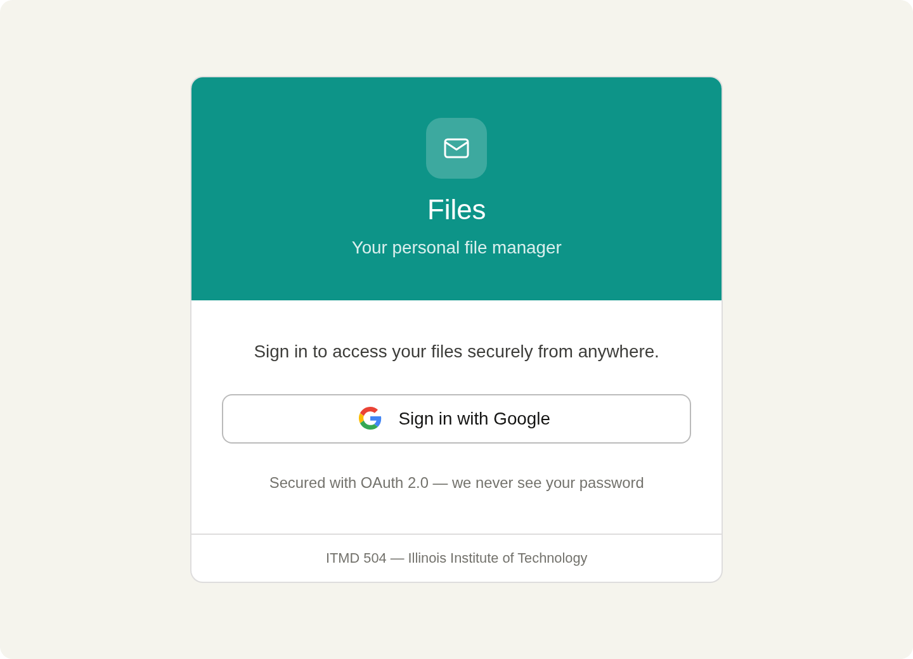

Centered card with the application branding, a Google-branded sign-in button, and a security note that the
application uses OAuth 2.0 and never sees the user's password.

### Empty drive ([[US-02]](https://github.com/warrenmnocos/oppshan-files/issues/4), [[US-05]](https://github.com/warrenmnocos/oppshan-files/issues/10))

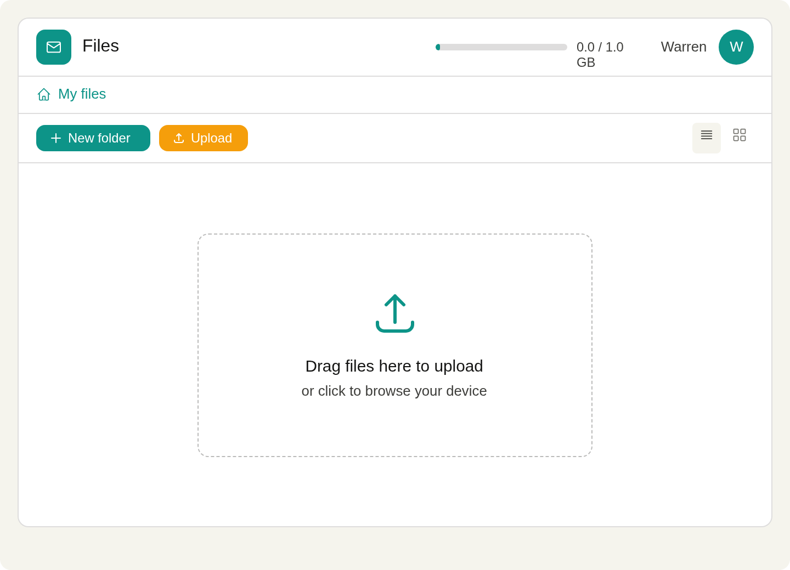

The first screen after sign-in. The toolbar shows the app logo, a storage usage bar, and the user's profile
avatar; the breadcrumb shows "My files"; the main area is a dashed drop zone guiding the user toward their first
upload.

### Populated drive — list view ([[US-06]](https://github.com/warrenmnocos/oppshan-files/issues/11), [[US-07]](https://github.com/warrenmnocos/oppshan-files/issues/12))

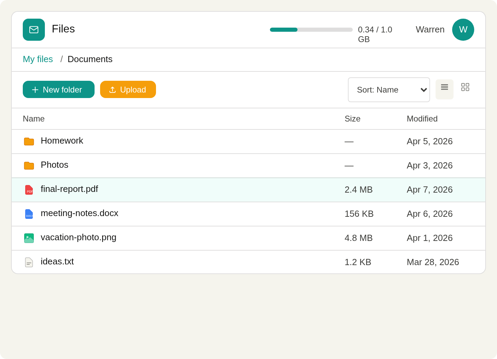

The main working state. Folders are sorted first with amber folder icons, followed by files with color-coded type
icons (red for PDF, blue for documents, green for images, gray for text). Columns: name, size, last modified.
Hovered rows pick up a teal outline; the row's kebab button on the right opens the same context menu as right-click
or long-press.

### Populated drive — grid view ([[US-08]](https://github.com/warrenmnocos/oppshan-files/issues/13))

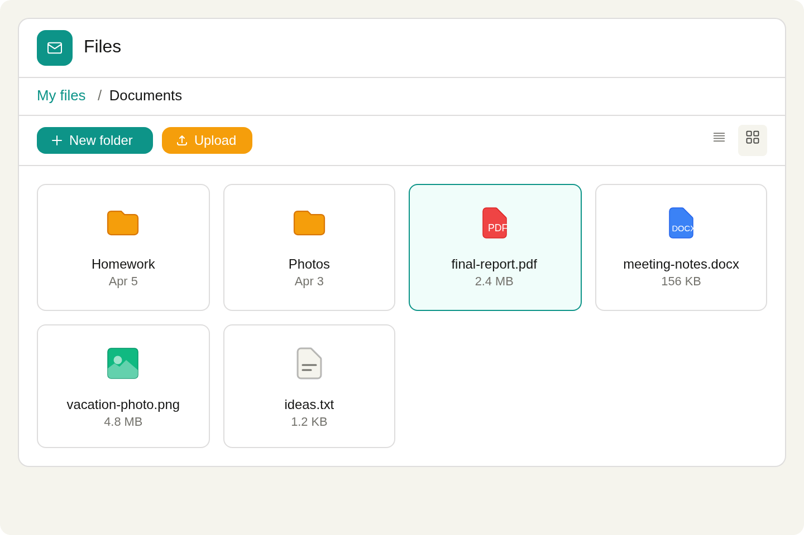

The same content rendered as a card grid. Each card shows a large file-type icon, the filename (truncated with
ellipsis if too long), and a metadata line. The grid uses CSS `auto-fill` with `minmax` for responsive columns.

### File context menu ([[US-20]](https://github.com/warrenmnocos/oppshan-files/issues/28))

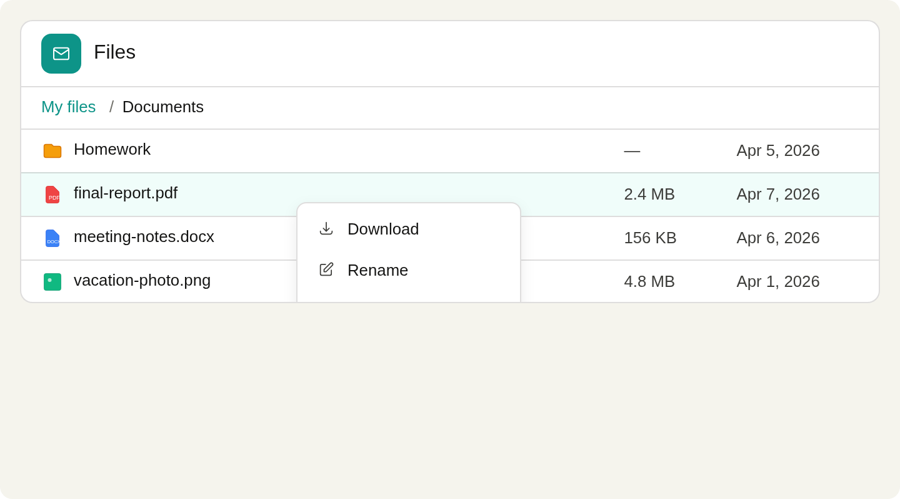

A file row exposes its actions through three equivalent triggers: a right-click on the row, a click on the row's
`⋮` (kebab) button, or a long-press on touch devices. Items: Download, Rename, Properties, Delete (Delete styled
in red). On wide viewports the menu floats and stays inside the visible viewport; on narrow viewports it slides
up as a bottom sheet with a tappable backdrop. The menu closes on outside click, Escape, scroll, or resize.

### Folder context menu ([[US-21]](https://github.com/warrenmnocos/oppshan-files/issues/29))

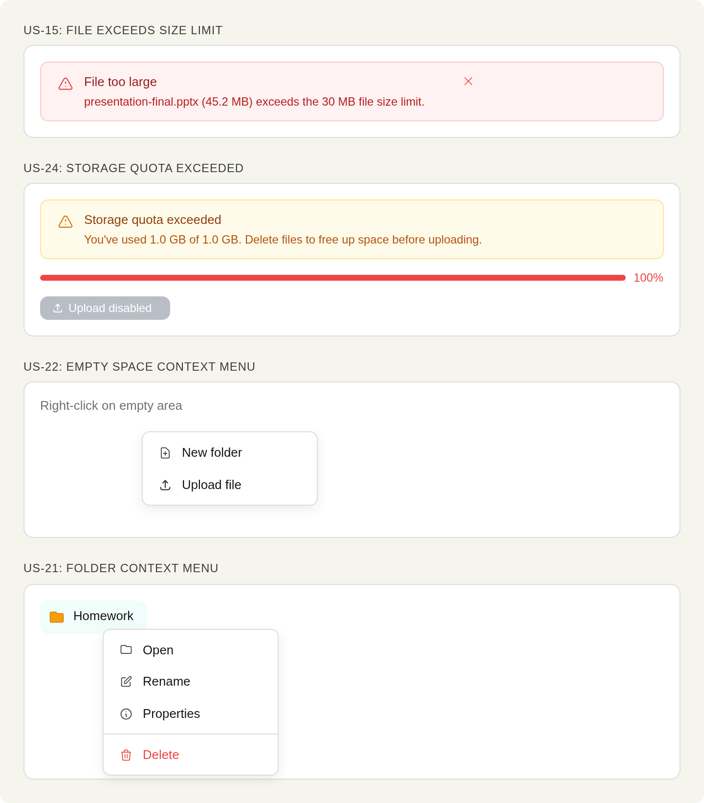

Folder rows and cards share the same context menu as US-20, with items adapted to the target type. Folder items:
Open, Rename, Properties, Delete. "Open" replaces "Download" and navigates into the folder.

### Empty space context menu ([[US-22]](https://github.com/warrenmnocos/oppshan-files/issues/30))


Right-clicking the empty area inside the directory view opens a contextual menu with Refresh, New folder, and
Upload file. Refresh re-fetches the current directory contents and shows the loading state during the refetch.
New folder and Upload file mirror the action-bar buttons. The empty-space variant is desktop-only; touch users
reach the same actions through the action bar.

### Create folder dialog ([[US-09]](https://github.com/warrenmnocos/oppshan-files/issues/15))

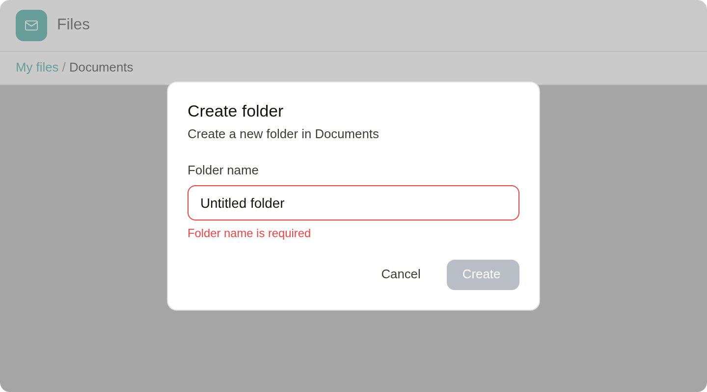

A custom dialog overlaying the drive view. Title, a text input labeled "Folder name" with placeholder
"Untitled folder", and Cancel/Create buttons. The mockup also shows the validation error state with a red border
and the disabled Create button.

### Rename dialog ([[US-10]](https://github.com/warrenmnocos/oppshan-files/issues/16), [[US-17]](https://github.com/warrenmnocos/oppshan-files/issues/24))

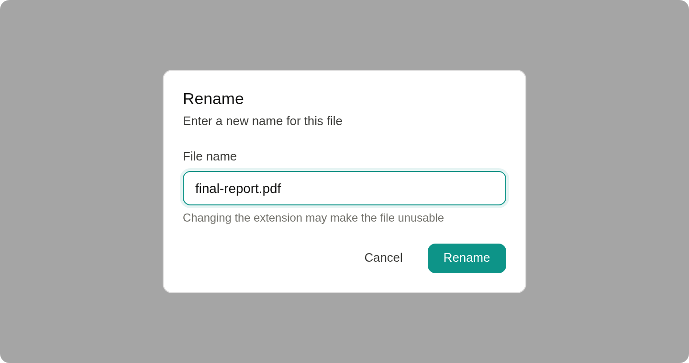

A dialog pre-filled with the current name. The input has a teal focus ring; helper text warns that changing the
extension may make the file unusable. The Rename button is teal.

### Delete confirmation dialog ([[US-11]](https://github.com/warrenmnocos/oppshan-files/issues/17), [[US-18]](https://github.com/warrenmnocos/oppshan-files/issues/25))

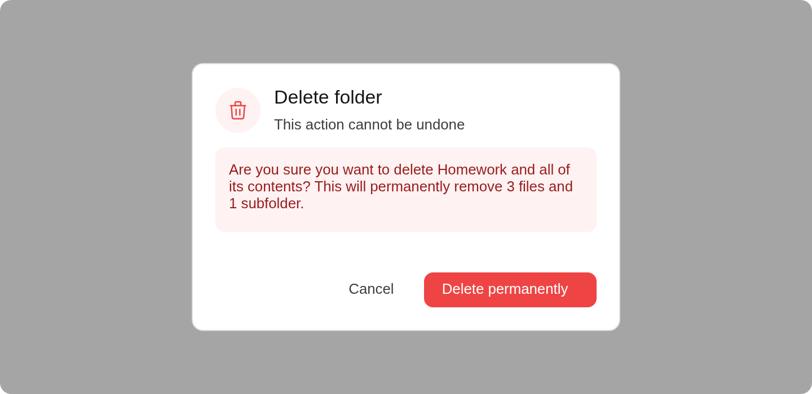

A destructive-action confirmation. Red warning icon, highlighted warning box explaining that deletion is permanent
and detailing affected items; red "Delete permanently" button. For folders, the message includes nested counts.

### Properties panel ([[US-12]](https://github.com/warrenmnocos/oppshan-files/issues/18), [[US-19]](https://github.com/warrenmnocos/oppshan-files/issues/26))

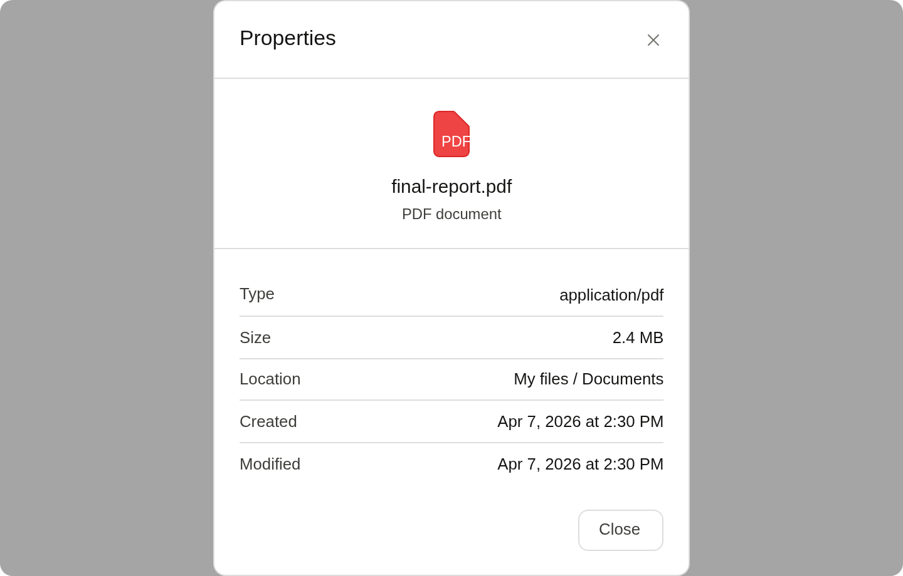

A read-only metadata dialog. Header shows file-type icon and name. Body lists properties in a two-column table:
type (MIME), size, location, created, modified.

### Upload progress ([[US-13]](https://github.com/warrenmnocos/oppshan-files/issues/20), [[US-14]](https://github.com/warrenmnocos/oppshan-files/issues/21))

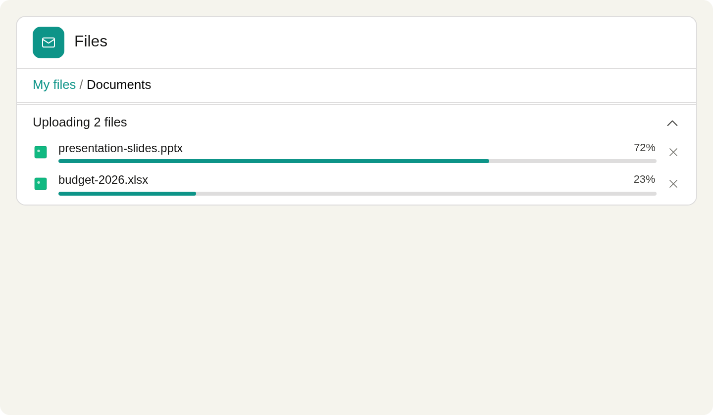

The upload progress section lives inside the `NotificationCenter`, a unified fixed bottom-right panel that renders
all application notifications. During active uploads the panel shows an "Uploading N files" header with a collapse
chevron. Each uploading file is a row with a green status dot, the filename, a teal progress bar with percentage,
and a × dismiss button. The panel stacks multiple concurrent uploads. Completed entries vanish; failed uploads
disappear and surface as toasts. This section is feature-agnostic: any future progress-emitting operation can add
entries using the same `ProgressNotification` model.

### Profile dropdown ([[US-03]](https://github.com/warrenmnocos/oppshan-files/issues/5), [[US-04]](https://github.com/warrenmnocos/oppshan-files/issues/6), [[US-23]](https://github.com/warrenmnocos/oppshan-files/issues/32))

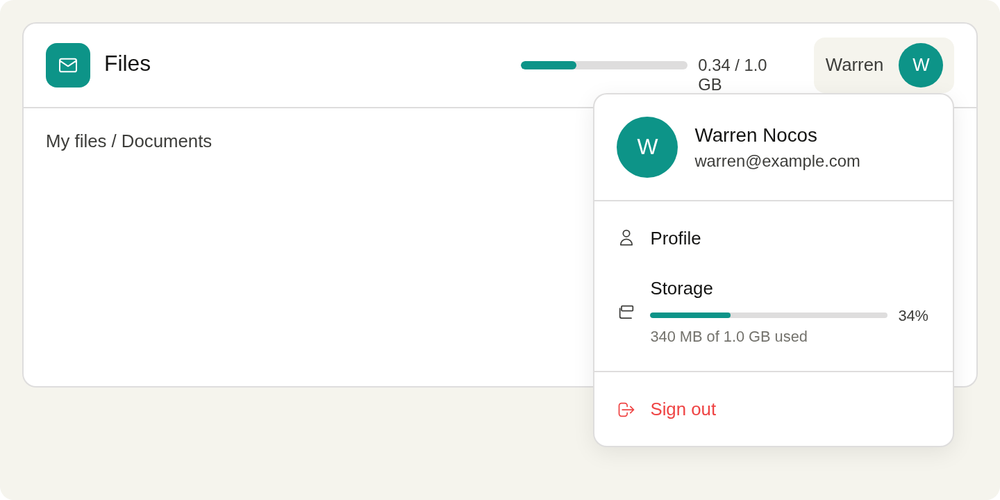

Clicking the avatar opens a dropdown showing the Google name and email, a Profile link, a storage usage section
with progress bar and percentage, and a red "Sign out" button. The storage bar changes color based on usage
([[US-23]](https://github.com/warrenmnocos/oppshan-files/issues/32)): teal for 0–70%, amber for 70–90%, red for
90–100%.

### Error states and notifications ([[US-15]](https://github.com/warrenmnocos/oppshan-files/issues/22), [[US-24]](https://github.com/warrenmnocos/oppshan-files/issues/33))


Validation errors and operation outcomes surface through the `NotificationCenter` toast section. File-too-large
errors and storage-quota errors appear as auto-dismissing toasts with severity styling derived from the
`MessageCode` prefix (`messages.errors.*` → error). Toasts support i18n interpolation via
`params: Record<string, unknown>` so messages can include dynamic values such as filenames or sizes. Operation
successes (folder created, file renamed, file deleted) appear as info-severity toasts in the same panel.

---

## CI/CD

Three **GitHub Actions** workflows take a change from pull request to production. Two of them run on every PR
(one **builds and tests**, the other runs **static analysis**); the third **automatically builds and deploys**
whatever lands on `main`.

### Continuous Integration

Every push and pull request to `main` runs two workflows. Both have to be green for the change to merge.

#### Build, test, and coverage

`.github/workflows/maven.yml` runs on every `push` and `pull_request` to `main`:

1. Check out the repository.
2. Install JDK 25 (GraalVM distribution) with Maven dependency caching.
3. Run `mvn -B clean install`, which compiles the Angular front end via `frontend-maven-plugin`, packages the back end,
   and runs the test suite. Tests use Quarkus Dev Services (Testcontainers PostgreSQL 18, ephemeral Keycloak realm)
   so the test profile exercises real PostgreSQL.
4. On pull requests, post a JaCoCo coverage report as a PR comment via
   [Madrapps/jacoco-report](https://github.com/Madrapps/jacoco-report), enforcing minimums of 40% overall and 60%
   on changed files.
5. Submit the Maven dependency graph for Dependabot vulnerability tracking.
6. Generate an SVG JaCoCo coverage badge and, on direct pushes to `main`, commit it back to `.github/badges/`.

The badge at the top of this README is the live coverage produced by this workflow. Test failures, missing
coverage thresholds, or compile errors fail the workflow and block merge.

#### Static analysis

`.github/workflows/qodana_code_quality.yml` runs on every `push` to `main` or `releases/*`, every `pull_request`, and
on manual `workflow_dispatch`:

1. Check out the actual PR commit (not the merge commit) with full history.
2. Run **Qodana JVM** static analysis ([JetBrains/qodana-action@v2025.3](https://github.com/JetBrains/qodana-action))
   against the project, uploading findings to the [Qodana Cloud](https://qodana.cloud) project for trend tracking
   over time.

Findings show up as PR check annotations.

### Continuous Deployment

Production deployment is **fully automated**: the Maven build emits a **GraalVM native binary**, and a GitHub
Actions workflow rolls it out to the EC2 instance on **every push to `main`** with no manual step in between.

#### Build pipeline

The frontend and backend share a single repository, but they're compiled independently and packaged into one
artifact by Maven. The `frontend-maven-plugin` bridges the two ecosystems: during `generate-resources` it installs
a project-local Node.js and Yarn, runs `yarn install` and `ng build`, and drops the compiled Angular bundle into
`target/classes/META-INF/resources/`, the classpath location Quarkus looks at for static content. After that,
Maven compiles the Java backend and Quarkus folds everything (API and SPA) into a single self-contained artifact.
At runtime, the same process serves both the Angular static files and the REST API on the same origin and port, so
CORS is never a factor.

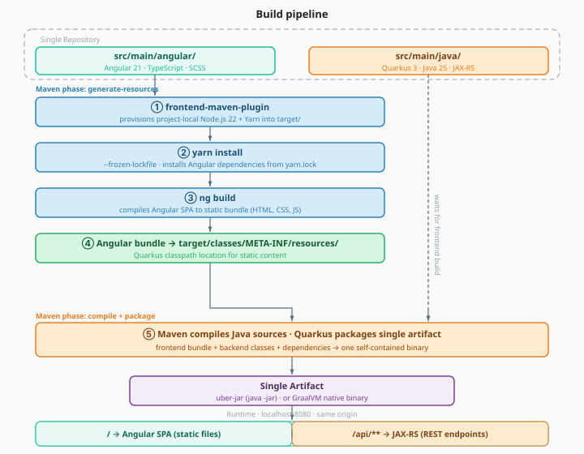

The Angular project has its own `package.json`, its own dev server (`ng serve`), and its own dependency tree. It's
a fully standalone frontend codebase that just happens to live inside the Maven project. One `./mvnw package`
produces a deployable artifact without any manual coordination between the two builds.

For production, the same project compiles to a **GraalVM native image** targeting **ARM64** with
`./mvnw -Pnative-release package` (Oracle GraalVM 25, `-march=armv8-a+aes+lse`, G1 GC). The native binary starts
in under 100 ms and runs with `-Xmx512m` heap on the deployment target.

#### Deployment target

Production runs on a single **AWS EC2 t4g.small** (Graviton 2 ARM, 2 vCPU, 2 GB RAM) on **Amazon Linux 2023**,
with **PostgreSQL 18 on the same instance** (not RDS or Aurora, which keeps cost predictable and removes cross-host
network hops for a personal-scale app). **Caddy** terminates TLS on `:443` with a wildcard `*.oppshan.com` cert
acquired automatically from Let's Encrypt via the **DNS-01 challenge against Route 53** (Caddy `route53` plugin,
backed by an EC2 instance role with scoped Route 53 permissions). The wildcard cert auto-renews ~30 days before
expiry; no ALB, no separate certificate management.

A single EIP gives the instance a stable public IP. Route 53 holds an A record `files.oppshan.com → <EIP>` and a CAA
record restricting cert issuance to Let's Encrypt. SSM Session Manager replaces SSH for operator access, so no port
22 is exposed and no key-pair management is needed.

#### Deployment automation

`.github/workflows/deploy.yml` runs on every push to `main` (and manual `workflow_dispatch`): it builds the native
binary on a `ubuntu-24.04-arm` GitHub-hosted runner, uploads to S3 keyed by short commit SHA, then issues an SSM Run
Command on the EC2 instance to `systemctl stop`, `aws s3 cp` the new binary, `chmod +x` + `chown`, and
`systemctl start`. Authentication uses **OIDC federation**: GitHub mints a short-lived JWT, AWS STS exchanges it for
temporary credentials based on a trust policy scoped to `repo:OWNER/REPO:ref:refs/heads/main`. No long-lived AWS keys
live in repository secrets.

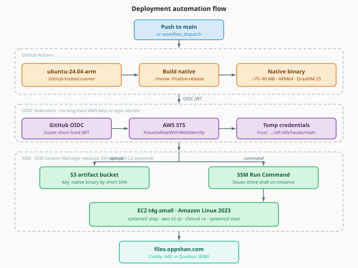

---

## Development Setup

### Prerequisites

- **Java 25** (Oracle GraalVM 25 required for production native builds because `--gc=G1` is Oracle-only;
  Edition is fine for `quarkus:dev` JVM mode)
- **Maven 3.9+** (the included `./mvnw` wrapper works without a global install)
- **Node.js 22+** and **Yarn** (installed automatically by the `frontend-maven-plugin` during the Maven build)
- **Docker** running locally, needed for Quarkus Dev Services (Testcontainers PostgreSQL and Keycloak)
- A **Google Cloud OAuth 2.0 client** with `http://localhost:8080/sso/sign-in/oidc/callback/google` added as an
  authorized redirect URI

### Environment variables

| Variable                            | Purpose                                                                      |
|-------------------------------------|------------------------------------------------------------------------------|
| `GOOGLE_CLIENT_ID`                  | Google OAuth client ID                                                       |
| `GOOGLE_CLIENT_SECRET`              | Google OAuth client secret                                                   |
| `TOKEN_ENCRYPTION_SECRET`           | Random secret used by Quarkus OIDC to encrypt token state in the cookie      |
| `APP_STORAGE_ENCRYPTION_PASSPHRASE` | Passphrase derived (PBKDF2, 1M iterations) into the AES-256 file content key |
| `QUARKUS_DATASOURCE_USERNAME`       | PostgreSQL username (production); defaults to `oppshan` in cloud-init        |
| `QUARKUS_DATASOURCE_PASSWORD`       | PostgreSQL password (production)                                             |
| `QUARKUS_DATASOURCE_JDBC_URL`       | PostgreSQL JDBC URL (production); includes timezone, batched-inserts options |

### Running locally

```bash
./mvnw quarkus:dev
```

This starts Quarkus in development mode at `http://localhost:8080` with hot reload for both the API and the Angular app.
The Angular dev tooling watches and rebuilds, and Quarkus serves the rebuilt assets immediately.

### Running tests

```bash
./mvnw test
```

Tests run against the **`test` profile**. Quarkus Dev Services start an ephemeral PostgreSQL 18 container via
Testcontainers and an ephemeral Keycloak realm for OIDC; Flyway runs the migrations against the container, the
test suite executes against real PostgreSQL, and the container is discarded after the suite completes. Docker must
be running.

### Production build

```bash
./mvnw clean package
java -jar target/oppshan-files-*-runner.jar
```

For the production native image (Oracle GraalVM 25, ARM64-tuned, debug stripped):

```bash
./mvnw -Pnative-release package
./target/oppshan-files-*-runner
```

---

*This project is developed as the final exam for ITMD 504 — Programming and Application Foundations at Illinois
Institute of Technology.*
